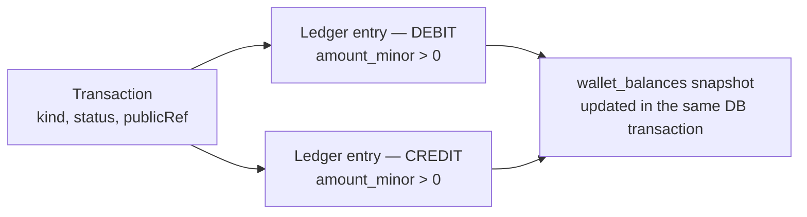
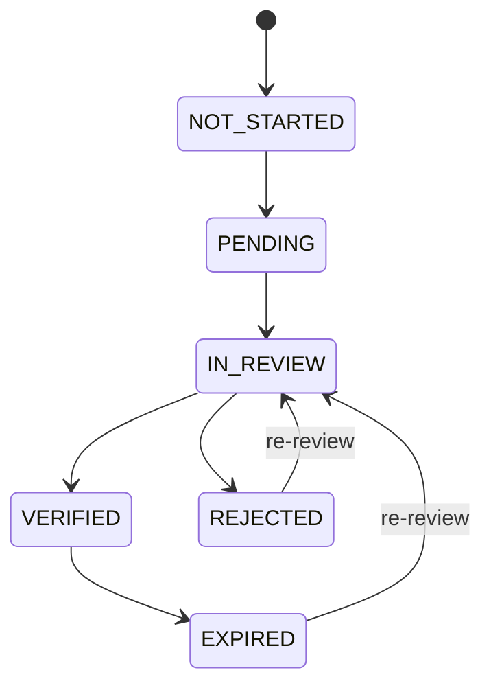

<div align="center">

# Vaultchain API (`Api/`)

**The NestJS service behind the Vaultchain operations console** — the system of record for
customers, KYC, wallets and limits, transactions, role-based access, multi-factor sign-in, and a
tamper-evident audit trail.

<em>NestJS 11 on Fastify · Prisma 7 · PostgreSQL 16 · code-first OpenAPI · double-entry ledger</em>

</div>

> New here? Start with the **[root README](../README.md)** for the whole product — what
> Vaultchain is, how to run the full stack, and the frontend this API serves.

---

## What is this?

The [Vaultchain](../README.md) web app is what an operations team *looks at*; this API is the
side that actually holds the data, decides who may see and change what, does the money math, and
records every sensitive action in a way that cannot be silently altered afterwards.

In engineering terms: a modular **NestJS 11** service on Fastify, talking to PostgreSQL 16
through **Prisma 7**. It exposes one versioned REST + OpenAPI contract, consumed by the Angular
frontend and any future client. The financial core is a double-entry ledger with idempotent
money operations; the audit trail is an append-only, hash-chained record.

Honest scope, up front: this is a **portfolio / case-study** application. It runs locally with
seeded demo data — there are no real customers, and it is not a deployed production system.

## Technology

| Concern | Choice |
|---|---|
| Runtime · framework | Node.js 22 (`.nvmrc`) · **NestJS 11** on **Fastify** |
| Language | **TypeScript** (strict) |
| Database · ORM | **PostgreSQL 16** · **Prisma 7** (`@prisma/adapter-pg`) |
| Password hashing | **Argon2id** (`@node-rs/argon2`) |
| Multi-factor auth | **otplib** (RFC-6238 TOTP) |
| Validation | **class-validator** + Nest `ValidationPipe` |
| API documentation | **`@nestjs/swagger`** (code-first, committed spec) |
| Logging | **Pino** (structured JSON) |
| Rate limiting | **`@nestjs/throttler`** |
| Security headers · cookies | **`@fastify/helmet`** · **`@fastify/cookie`** |

No mapper library, no charts, no Web3 SDK on the backend — the dependency footprint is kept
deliberately small.

## Module map

The API is composed of focused NestJS modules under `src/modules/` — **13 modules, 20
controllers** — each owning its controllers, use-case services, and DTOs.

| Module | Responsibility |
|---|---|
| **auth** | Login, refresh, logout, `me`; session and token lifecycle |
| **mfa** | MFA (TOTP two-step verification) — enrolment / verification, 10 single-use backup codes, trusted devices, audited admin MFA reset |
| **password-reset** | On-screen self-service reset (email → code → new password) + admin-approved reset queue |
| **customers** | Customer CRUD, KYC verifications, PII masking / audited reveal |
| **wallets** | Wallet detail and balance; daily / monthly limit updates (optimistic concurrency via `rowVersion`) |
| **transactions** | Idempotent, double-entry transaction recording and history |
| **rbac** | Roles, permissions, user-role assignment; admin user list |
| **risk** | Risk decisions, screenings, decision history (signals are simulated and labeled as such) |
| **analytics** | Dashboard summary, KYC distribution, recent customers, daily metrics |
| **notification** | Recipient-scoped notification feed; mark read / mark all read |
| **realtime** | The Server-Sent Events stream and its short-lived stream cookie |
| **operator** | Operator (staff) settings |
| **catalog** | Reference data — supported currencies |

A public liveness probe lives outside the modules, under `src/common/health`:
`GET /api/v1/health`.

## Data model highlights

The guarantees that matter live in the schema — 26 models; the full inventory is in
[docs/data-model.md](../docs/data-model.md). The parts that make the system trustworthy rather
than merely functional:

**Double-entry ledger.** Money is never a float. Amounts are stored as `BigInt` **minor units**
(integer cents); every transaction writes balanced `ledger_entries` legs tagged `DEBIT` /
`CREDIT`, each with `amount_minor > 0` enforced by a database `CHECK`. The `wallet_balances`
snapshot is updated **in the same database transaction**, so the cached balance and the ledger
can never drift — the balance stays derivable from, and reconcilable with, the entries.
Per-wallet `entry_seq` is `UNIQUE`, so two entries can never share a sequence number even under
concurrency.



**KYC lifecycle.** Verification status moves through an enforced state machine; the full history
is kept in the append-only `kyc_verifications` table, and the current status is cached on the
customer row for fast reads. A compliance operator may verify directly from a neutral state, but
a negative outcome (`REJECTED` / `EXPIRED`) must pass re-review before it can become `VERIFIED`
again, and a `VERIFIED` customer can never be downgraded to `NOT_STARTED` / `PENDING`. The
diagram shows the primary paths; the full matrix lives in
`src/modules/customers/kyc-transitions.ts`.



**Tamper-evident audit trail.** Sensitive actions append to `audit_logs`, a table whose
`UPDATE` / `DELETE` privileges are revoked at the database level. Every row joins a **hash
chain**: `entry_hash = SHA-256(previous hash + canonical payload)` — altering or deleting a
historical row breaks the chain and is detectable. Rows carry `ip_hash` instead of raw IPs and
masked context instead of raw PII, and appends are serialized on a PostgreSQL advisory lock so
chain order survives concurrency.

**Optimistic concurrency.** Wallet and customer updates detect conflicts through a `rowVersion`
column — when two operators edit the same record at once, neither write is silently lost.

Schema strategy: versioned migrations under [`prisma/migrations/`](prisma/migrations/), applied with
`npm run migrate:deploy`, plus SQL backstops under
[`prisma/sql/`](prisma/sql/) — `integrity.sql` (database `CHECK` constraints and the public-ref
sequence), `db-security.sql` (least-privilege database roles and RLS policies), and a `pg_trgm`
index for fast customer search.

## API surface

Every endpoint sits under the `/api/v1` prefix, so the contract can evolve without silently
breaking existing clients. Responses share one envelope.

**Success** responses wrap the data and carry a correlation id:

```json
{ "data": { "...": "..." }, "meta": { "correlationId": "..." } }
```

**Paginated** responses add a `page` block:

```json
{
  "data": ["..."],
  "meta": { "correlationId": "..." },
  "page": { "number": 1, "size": 25, "totalItems": 1500, "totalPages": 60 }
}
```

**Errors** use a single shape — clients never guess:

```json
{ "error": { "code": "...", "message": "...", "details": "...", "correlationId": "..." } }
```

**Pagination** is query-based: `page[number]` (≥ 1, default 1) and `page[size]` (1–100,
default 25).

**Idempotency.** Money-moving writes accept an `Idempotency-Key` header. The API fingerprints
the request (SHA-256 over the canonicalized body) and tracks it through `IN_PROGRESS` →
`COMPLETED`: the same key with the same body returns the stored response, the same key with a
**different** body is rejected with `409`. A 24-hour `expiresAt` is recorded for cleanup, but it
is not enforced on lookup yet; until a cleanup sweep runs, older completed keys still replay their
stored response. The critical detail: the idempotency record commits **in the same database
transaction** as the ledger write — a retry can never double-book.

## OpenAPI

The contract is not hand-written prose — it is an **OpenAPI 3.0** spec generated straight from
controllers and DTOs via `@nestjs/swagger`.

- **Scope:** **54 paths / 61 operations** (GET 25 · POST 28 · DELETE 4 · PATCH 3 · PUT 1), including
  the SSE live stream.
- **Committed:** the generated spec lives in the repo as [`openapi.json`](openapi.json) and is
  served by the running service at **`/api/v1/docs-json`**.
- **Drift gate:** CI regenerates the spec (and the TypeScript types derived from it) with
  `npm run openapi:generate` and fails the build if the result differs from what is committed.
  The documented contract cannot silently drift from the running code.

Endpoint families at a glance (paths per family):

| Family | Paths | | Family | Paths |
|---|---:|---|---|---:|
| `auth` | 23 | | `roles` | 3 |
| `customers` | 9 | | `users` | 3 |
| `dashboard` | 6 | | `catalog` · `permissions` · `transactions` · `metrics` · `health` | 1 each |
| `operator` | 5 | | | |

A guided tour of the endpoints lives in [docs/api-reference.md](../docs/api-reference.md).

## Security

Security is not a layer bolted on the side — it is how sessions, roles, and sensitive fields
work. The full picture is in [docs/security-model.md](../docs/security-model.md) and
[docs/auth-and-rbac.md](../docs/auth-and-rbac.md); the essentials:

**Sessions.** Signing in yields a short-lived (**15-minute**) **access JWT** carrying the
caller's permission list; a global **default-deny** guard protects every route not explicitly
marked public. The client holds the access token in memory only. Alongside it rides a
**rotating refresh token** — Argon2id-hashed, in an httpOnly `SameSite=Strict` cookie — rotated
on every use, with replay detection that closes the whole session family. Passwords are stored
with **Argon2id**.

**Roles (RBAC).** Three roles, enforced **server-side** with `@RequirePermissions` (AND
semantics) — the frontend hiding controls is a courtesy only:

| Role | What it can do |
|---|---|
| **Administrator** | Everything — customer delete (soft-delete), PII reveal, role/user management, operator MFA reset |
| **Compliance Officer** (`operator`) | Day-to-day work: customer, wallet, transaction, and KYC management plus all reads. **No** delete, **no** PII reveal, **no** role management |
| **Viewer** (`auditor`) | Read-only |

**MFA (TOTP two-step verification).** MFA is **opt-in**. It uses RFC-6238 TOTP; the shared
secret is stored under **AES-256-GCM envelope encryption** and never returned to the client.
Each account gets **10 single-use backup codes** (Argon2id-hashed). The post-password challenge
is an opaque, single-use token in an httpOnly cookie with a bounded attempt count, and reused
TOTP codes are rejected by tracking the last consumed time step. Optional **trusted devices**
(off by default; revoked on password change, MFA disable, or admin reset) and an audited
**admin MFA reset** complete the picture.

**PII protection.** The national ID is stored under **AES-256-GCM envelope encryption**
(`national_id_enc`) and is **never decrypted on the read path** — only `national_id_last4` is
shown. Other PII (name, email, phone, wallet, address) is **masked by default**. Unmasked data
requires both the `customers.pii.reveal` permission **and** an explicit `?reveal=true` query
flag; without the permission the flag is silently ignored, and every reveal is written to the
audit trail. The encryption envelope uses a local master key and is designed to move to a KMS.
The posture throughout: minimize, encrypt, mask, audit.

**Rate limiting.** Global 100 requests/min per IP, tightened to 10/min on auth endpoints and
30/min on customer writes.

**Strict boot / fail-fast.** The API refuses to start with missing or weak configuration. Under
`NODE_ENV=production`, hardening is mandatory: JWT secrets must be at least 32 characters, an
explicit CORS allowlist must be set, and the rate limiter cannot be disabled.

> **Honesty about what is not live.** The external daily **WORM audit anchor** is a designed
> extension, not built. Database **row-level security (RLS)** is wired in code (operator context
> + role separation) but ships **off by default** (`DB_RLS_ENFORCED`) and awaits a deployment
> target.

## Realtime (SSE)

The console updates without asking: when customer data changes, connected screens (dashboard,
customers, analytics) receive a push instead of re-fetching on a timer.

Under the hood this is native **Server-Sent Events** via Nest's `@Sse` decorator on
`GET /api/v1/dashboard/stream`. The stream is authorized by a short-lived httpOnly cookie
(`ftd_stream`) — the token is **never in the URL**, so it cannot leak into logs, browser
history, or `Referer` headers. Notifications on the stream are **recipient-scoped** (each
operator receives only their own), and the server emits a named `ping` keepalive every
25 seconds so idle connections and proxies stay healthy.

Scale-out is optional: with `REDIS_URL` set, realtime events fan out across instances through
Redis pub/sub and rate-limit counters become distributed; unset, both stay in-process — and a
Redis failure never crashes the API.

## Tests

Money-critical paths are tested against **real PostgreSQL**, not mocks.

- **Unit:** **100 suites · 980 tests** (Jest); measured coverage **99.6% statements · 97.45%
  branches · 99.41% functions · 99.85% lines**.
- **Coverage floors (the build fails below them):** **95 statements · 95 lines · 90 functions ·
  92 branches**, plus a **≥ 90% per-file floor** on all four metrics via the root
  `npm run coverage:files:check`.
- **Integration:** **16 suites · 190 tests** — each run self-provisions a disposable
  **`postgres:16-alpine`** container via `docker run`, applies `prisma migrate deploy`, and exercises
  the **real HTTP stack** end to end: ledger, idempotency, the RBAC role matrix, the audit
  chain, the RLS switch, and SSE.

```bash
npm test          # unit suites (*.spec.ts)
npm run test:cov  # unit + coverage floors
npm run test:int  # integration suites (*.int-spec.ts) — requires Docker
```

## Running it

From the **repo root** — no secrets, tokens, or hand-written `.env` needed for local
development:

```bash
npm run dev:api    # PostgreSQL (Docker) + API on :3000
npm run dev        # database + API (:3000) + Web (:4200) together
npm run db:reset   # force a clean reseed
```

Once up, the liveness probe answers at `/api/v1/health`. The local seed creates three demo
operator accounts (`admin@example.com` / `operator@example.com` / `auditor@example.com`,
password `Test-Passw0rd!` — local development only) and about 1,500 fictional customers with
wallets, transactions, and analytics aggregates. Seeding runs **only when the database is
empty**; later runs leave existing data alone.

Useful commands from inside this folder (`Api/`):

```bash
npm run lint              # strict typecheck (tsc --noEmit)
npm run build             # nest build
npm run openapi:generate  # regenerate openapi.json + generated client types (feeds the CI drift gate)
npm run prisma:generate   # generate the Prisma client
```

Local development runs on safe defaults. The variables below matter in a hardened / production
environment — **names only; values are never committed**:

| Variable | Purpose |
|---|---|
| `NODE_ENV` | Environment mode; `production` turns on fail-fast hardening |
| `PORT` | HTTP port the API listens on (default 3000) |
| `DATABASE_URL` | PostgreSQL connection string |
| `JWT_ACCESS_SECRET` | Access-token signing key (≥ 32 chars in production) |
| `JWT_REFRESH_SECRET` | Refresh-token signing key (≥ 32 chars in production) |
| `FTD_PII_MASTER_KEY` | Master key for the PII / national-ID encryption envelope |
| `CORS_ORIGINS` | Explicit allowlist of browser origins |
| `REDIS_URL` | Optional — enables cross-instance realtime fan-out and distributed rate-limit counters |
| `DB_RLS_ENFORCED` | Optional, default off — set `1` to apply the row-level-security operator context |
| `MIGRATE_DATABASE_URL` | Optional — elevated connection used only for schema changes when the runtime connection is least-privilege |

## Related documentation

- [Root README](../README.md) — the whole product
- [Web/README.md](../Web/README.md) — the frontend in depth
- [docs/README.md](../docs/README.md) — documentation hub
- [docs/architecture.md](../docs/architecture.md) — system architecture
- [docs/data-model.md](../docs/data-model.md) — the full schema
- [docs/testing-and-quality.md](../docs/testing-and-quality.md) — test strategy and gates
- [SECURITY.md](../SECURITY.md) — security policy
- [DOCKER.md](../DOCKER.md) — running everything in Docker

<div align="center"><sub>Vaultchain · <code>Api/</code> workspace · NestJS 11 (Fastify) · Prisma 7 · PostgreSQL 16 · double-entry ledger</sub></div>
