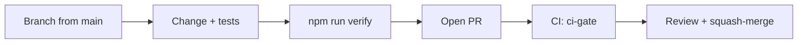

# Contributing

Thanks for your interest in improving Vaultchain. This guide covers local setup, the repository
layout, branch and commit conventions, the full quality-gate suite a change must pass, and the
pull-request process.

## Prerequisites

| Requirement | Version | Used for |
| ----------- | ------- | -------- |
| [Node.js](https://nodejs.org) | 22 — pinned in `.nvmrc`, so `nvm use` picks it up | Builds, tests, and all repo tooling |
| Docker Desktop | current | The local database, the API integration tests, and the demo stack |

No global CLI installs are needed — the Angular and Nest CLIs run from local dependencies.

## Getting started

From the repository root:

```bash
npm run setup   # once: install Web + Api dependencies, create and seed the local database
npm run dev     # daily: Web (http://localhost:4200) and Api (http://localhost:3000) together
```

Useful variants:

```bash
npm run dev:web    # frontend only
npm run dev:api    # backend only
npm run db:reset   # recreate and reseed the local database
npm run demo       # full Dockerized stack at http://localhost:8080 — see DOCKER.md
```

First sign-in with the seeded demo users and a short product tour are covered in
[docs/getting-started.md](docs/getting-started.md).

## Repository layout

| Path       | Contents                                                                  |
| ---------- | ------------------------------------------------------------------------- |
| `Web/`     | Angular 21 frontend — Vitest unit/component tests, Cypress end-to-end suites |
| `Api/`     | NestJS 11 backend — Jest unit tests, integration tests against real PostgreSQL |
| `docs/`    | Product and engineering documentation — start at [docs/README.md](docs/README.md) |
| `scripts/` | Zero-dependency Node tooling: the quality gates below plus the local run orchestrators (`setup`, `dev`) |

## Branches and commits

- Branch names follow `{type}/{scope-or-task}` — e.g. `feat/customer-notes`, `fix/wallet-limit-rounding`.
- Commit messages and PR titles follow [Conventional Commits](https://www.conventionalcommits.org/):
  `type(scope): summary`, with types `feat`, `fix`, `docs`, `style`, `refactor`, `perf`, `test`,
  `chore`, `build`, `ci`.
- Keep each PR scoped to one change. `main` is protected; PRs are squash-merged.

## Quality gates

Everything below must be green before a PR is ready for review. CI runs the same gates — the
measured test counts, coverage numbers, and the CI job map live in
[docs/testing-and-quality.md](docs/testing-and-quality.md).

| Gate | Run from | Command | What must hold |
| ---- | -------- | ------- | -------------- |
| Formatting | `Web/` | `npm run format:check` | Prettier clean on `src/**/*.{ts,html,json}` |
| Style lint | `Web/` | `npm run lint:styles` | Stylelint clean on all SCSS |
| Web tests | `Web/` | `npm test` | Vitest green, with coverage thresholds: 97% statements, 98% lines, 97% functions, 94% branches |
| Web production build | `Web/` | `npm run build -- --configuration production` | Builds within budgets: initial bundle 650 kB warn / 1 MB error, per-component styles 8 kB warn / 18 kB error |
| Api type check | `Api/` | `npm run lint` | Strict `tsc --noEmit` passes |
| Api unit tests | `Api/` | `npm test` | Jest green, with coverage floors: 95% statements, 95% lines, 90% functions, 92% branches |
| Api build | `Api/` | `npm run build` | Nest build succeeds |
| OpenAPI contract | `Api/` | `npm run openapi:generate` | `git diff` stays clean for `openapi.json` and `src/generated/api-types.ts` — CI fails on drift |
| Api integration tests | `Api/` | `npm run test:int` | Green against a disposable real PostgreSQL 16 container (needs Docker) |
| Per-file coverage | root | `npm run coverage:files:check` | Every measured file in both stacks at or above 90% on all four metrics |
| Docs integrity | root | `npm run docs:check` | Every relative link and image in tracked Markdown resolves to a tracked path |
| Sensitive files | root | `npm run sensitive:check` | No `.env` files, key material, or build artifacts tracked by git (filename-based; no contents are read) |
| i18n parity | root | `npm run i18n:check` | Turkish and English catalogs in full key parity (963 keys each), interpolation tokens match, every referenced key exists |
| Dependency policy | root | `npm run deps:check` | Permissive-license allowlist, no floating version specs, lockfiles present — across root, `Web/`, and `Api/` |
| End-to-end | root | `npm run e2e` | Cypress suite (Chrome) green against a dev server on `http://localhost:4200` |

### One-command verification

The aggregator runs the root static gates plus the Web and Api test-and-build pipelines — a fast
local subset of the CI gates — so you can catch most problems offline before pushing:

```bash
npm run verify        # static gates + Web style lint/test/build + Api test/build
npm run verify:fast   # static gates + Web style lint only (skips test/build)
```

It does not cover the whole table: formatting, the Api type check, the OpenAPI drift gate, the
integration tests, the per-file coverage gate, and the end-to-end suite run separately — and CI
enforces all of them — so a green `verify` alone does not guarantee a green `ci-gate`.

The root static checks are read-only: they verify, they never rewrite. The one deliberate
exception in the table is `npm run openapi:generate`, which regenerates the committed contract
files — the gate is that `git diff` stays clean afterwards. `docs:check` and `sensitive:check`
validate the git-tracked tree, so what a fresh clone gets is exactly what is checked.

### Coverage expectations

The aggregate thresholds in the table are enforced by the test runners themselves, and
`npm run coverage:files:check` additionally holds **every measured file at 90% or above** on
statements, lines, functions, and branches. New code arrives with tests; never lower a threshold
to get a change through.

## Pull requests



1. Branch from `main`, make the change, and run the gates above.
2. Fill in the pull request template (tests, gates, docs, no secrets).
3. CI must be green — the aggregate **`ci-gate`** check is required for merge.
4. A maintainer reviews and squash-merges.

## Security issues

Please do not report security vulnerabilities through public issues — see
[SECURITY.md](SECURITY.md) for the disclosure process.
