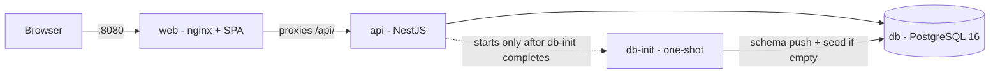

# Docker — Local Run Guide

This guide covers running Vaultchain locally with Docker. One command builds the whole stack —
the Angular web app, the NestJS API, and a PostgreSQL database — and brings it up already populated
with demo data. It is meant for local viewing and evaluation on your own machine, not for
production deployment.

## Prerequisites

- **Docker Desktop** running.
- **Node 22** (the version pinned in `.nvmrc`) — used by the npm scripts that wrap Docker Compose.
- The first build pulls the base images (Node, nginx, PostgreSQL) once; later builds reuse them.

## Quick start

From the repository root:

```bash
npm run demo        # = docker compose up --build
```

Then open **http://localhost:8080** in your browser. The web container serves the app and
reverse-proxies API calls to the backend, so everything is same-origin — the browser never talks to
the API container directly.

> [!WARNING]
> This is a local demo only. The web port is published on all host interfaces by Docker's default
> port mapping, and the seeded Administrator account uses publicly documented demo credentials.
> Run it only on a trusted local machine or private network; do not expose port `8080` to an
> untrusted network or use this compose stack as a production deployment.

To stop the stack while keeping your data:

```bash
npm run demo:down   # = docker compose down — stops containers, keeps the data volume
```

For a full reset that also deletes the database volume:

```bash
docker compose down -v   # stops AND removes the seeded data
```

Demo sign-in and a product tour are covered in [docs/getting-started.md](docs/getting-started.md).

## The stack



| Service   | What it is                                        | Where |
| --------- | ------------------------------------------------- | ----- |
| `web`     | Angular app served by nginx, proxying `/api/` to the backend | http://localhost:8080 |
| `api`     | NestJS backend                                    | loopback only: `127.0.0.1:3000` (`/api/v1/health` for a liveness check) |
| `db`      | PostgreSQL 16                                     | internal to the compose network; also published on `127.0.0.1:55432` for host tools |
| `db-init` | One-shot schema push + seed-if-empty job          | runs on `up`, exits when done |

The images are **multi-stage**: dependencies and the compiled build are produced in Node builder
stages, and only the runtime artifacts are copied into small final images (nginx for the web, a
non-root Node runtime for the API). All base images are digest-pinned.

> **Note:** `docker-compose.override.yml` is intentionally committed. The base
> `docker-compose.yml` stays canonical — there, seeding is a separate opt-in step
> (`docker compose --profile setup run --rm db-setup`). Docker Compose auto-merges the override on
> a plain `docker compose up`, and that is what turns the base stack into the one-command demo: it
> publishes PostgreSQL on `127.0.0.1:55432` for host tools and adds the one-shot `db-init` job that
> the API waits for.

## Seed-once behavior

On the **first** run, `db-init` pushes the Prisma schema, applies the integrity SQL (constraints
the schema language cannot express), and loads the demo dataset. The API container starts only
after `db-init` completes, so the app comes up already populated and there is no empty-database
window.

The demo data is 3 demo users — an Administrator (`admin@example.com`), a Compliance Officer
(`operator@example.com`), and a Viewer (`auditor@example.com`), all with the intentionally
non-secret password `Test-Passw0rd!` — plus roughly 1,500 fictional customers, multi-currency
wallets, transactions, and analytics rollups.

Seeding happens **once**. Because the demo seed is a full reset, `db-init` first checks a sentinel —
`SELECT count(*) FROM public.metric_daily` — and skips seeding whenever the analytics rollup table
already has rows. Re-running `npm run demo` therefore never wipes an existing volume.

```bash
npm run demo                                           # first run seeds; later runs reuse the data
FTD_SEED_FORCE=1 docker compose run --rm db-init       # force a clean reseed on purpose
docker compose down                                    # stop, keep the data volume
docker compose down -v                                 # stop AND delete the data volume
```

## Configuration

The stack starts with built-in defaults and needs no configuration to run. To override values,
copy the example env file that sits next to the compose file and edit your copy:

- root: `.env.docker.example` → `.env`
- backend: `Api/.env.docker.example` → `Api/.env`

The values shipped in the examples are dev-only sample values, never real secrets.

| Variable | Default | Effect |
| -------- | ------- | ------ |
| `POSTGRES_USER` / `POSTGRES_PASSWORD` / `POSTGRES_DB` | `postgres` / `postgres` / `fintech_dev` | Database credentials and name |
| `WEB_HOST_PORT` | `8080` | Host port for the web app (published on all host interfaces by default; local demo only) |
| `API_HOST_PORT` | `3000` | Host port for the API (bound to loopback by default) |
| `DB_HOST_PORT` | `55432` | Host port PostgreSQL is published on (loopback) |
| `JWT_ACCESS_SECRET` / `JWT_REFRESH_SECRET` | dev-only fallbacks | JWT signing secrets |
| `CORS_ORIGINS` | `localhost:4200`, `:4201`, `:8080` | Allowed browser origins for direct or hybrid API access |
| `NG_CONFIGURATION` | `stage` | Angular build configuration baked into the web image |
| `FTD_SEED_FORCE` | `0` | Set to `1` to force a clean reseed on the next `db-init` run |

## Common commands

```bash
docker compose up --build -d     # start detached
docker compose logs -f api       # follow a service's logs
docker compose ps                # show container status
docker compose down              # stop (keep the data volume)
docker compose down -v           # stop AND delete the database volume
```

## Notes and known caveats

- **Web build configuration.** The web image builds the Angular app with `NG_CONFIGURATION=stage`
  by default: an optimized bundle that uses the same relative `/api/v1` API path as production,
  but without the production configuration's bundle-budget assertions (those run in CI's web job).
  To bake the `production` configuration instead:
  `NG_CONFIGURATION=production docker compose up --build`.
- **API binding.** The API is published on loopback (`127.0.0.1`) by default, so the dev-fallback
  JWT secrets are never reachable from the network; `web` talks to `api` over the internal compose
  network. Expose it more widely only by explicitly setting `API_BIND=0.0.0.0` — and only with
  real `JWT_ACCESS_SECRET` / `JWT_REFRESH_SECRET` values.
- **Encryption key in local dev.** The compose stack runs the API in development mode, so PII column
  encryption uses a clearly-labeled dev-only fallback key. A production-mode run refuses to boot
  without a real `FTD_PII_MASTER_KEY` — provide one (and use the same key when seeding) for a
  production-faithful run.
- **Scope.** These images target local development and evaluation. Production deployment tooling is
  intentionally out of scope for this project — see
  [docs/deployment-and-operations.md](docs/deployment-and-operations.md) for the honest boundary.

## Related docs

- Zero-to-running walkthrough (npm-native and Docker paths): [docs/getting-started.md](docs/getting-started.md)
- Topology, configuration reference, and hardening: [docs/deployment-and-operations.md](docs/deployment-and-operations.md)
- Project overview: [README.md](README.md)
