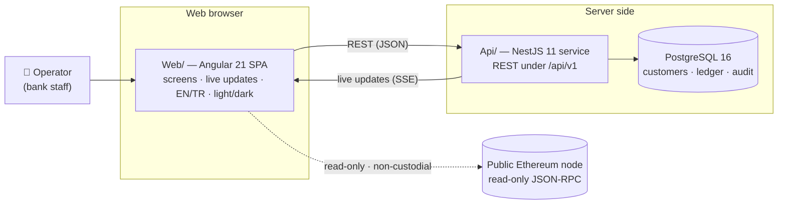
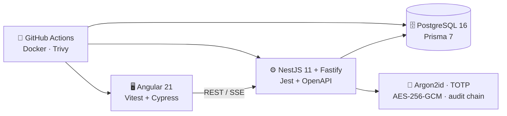

<div align="center">

# Vaultchain

### The back-office console for fintech operations — customers, KYC, wallets, transactions and read-only on-chain risk, on one screen.

[](https://github.com/faruk-sekman/vaultchain-fintech-dashboard/actions/workflows/ci.yml)
[](LICENSE)
[](.nvmrc)
[](Web/README.md)
[](Api/README.md)

<em>A full-stack fintech operations platform — Angular front end + NestJS back end — built with the
correctness, security and privacy discipline a real product team would demand.</em>

</div>

---

## 📖 Table of contents

- [What is this?](#-what-is-this)
- [Technology map](#-technology-map)
- [Run it in 60 seconds](#-run-it-in-60-seconds)
- [Feature tour](#-feature-tour)
- [Architecture](#-architecture)
- [Quality and the test pyramid](#-quality-and-the-test-pyramid)
- [Screen gallery](#-screen-gallery)
- [API contract](#-api-contract)
- [Project structure](#-project-structure)
- [Documentation](#-documentation)
- [Security](#-security)
- [Honest scope](#-honest-scope)
- [License](#-license)

---

## 🧭 What is this?

Imagine the staff-only control room behind a digital bank — the screens employees use to look up a
customer, check their identity-verification (KYC) status, review the money moving through their
account, and flag a suspicious crypto wallet. **Vaultchain is a modern, self-contained version of
that control room, built end to end.**

Its users are **operators** — compliance officers, operations analysts, administrators and
auditors — not the bank's end customers. They need one place to answer *"Who is this customer, is
their KYC done, what have they transacted, and is their wallet risky?"* — quickly, safely, and with
a record of who did what.

Vaultchain is a **monorepo** with two applications that talk over one versioned contract:

| Part | What it is | Built with |
|---|---|---|
| [**`Web/`**](Web/README.md) | The operations console you see and click | Angular 21, TypeScript |
| [**`Api/`**](Api/README.md) | The server that holds the rules and the data | NestJS 11 (Fastify), Prisma 7, PostgreSQL 16 |

> [!NOTE]
> This is a **portfolio / case-study** project. It runs on your own machine with realistic **seeded
> demo data** — there are no real customers. Its blockchain features are **read-only and
> non-custodial**, and its risk signals are **clearly labeled as simulated** in the UI. See
> [Honest scope](#-honest-scope).

---

## 🚀 Run it in 60 seconds

**Prerequisites:** [Node.js 22](https://nodejs.org) and Docker Desktop (for the local database).
No accounts, API keys, or secrets to configure — zero-config bootstrap.

```bash
# 1. Set up once (installs both apps, provisions PostgreSQL in Docker,
#    applies the schema and seeds demo data — only if the database is empty)
npm run setup

# 2. Run everything together — database + API (:3000) + web app (:4200)
npm run dev
```

…then open **http://localhost:4200** and sign in with a demo account:

| Email | Role | What they can do |
|---|---|---|
| `admin@example.com` | **Administrator** | Everything — reveal masked PII, delete customers, manage roles & operators, reset MFA (TOTP two-step verification) |
| `operator@example.com` | **Compliance Officer** | Day-to-day operations — **no delete, no PII reveal, no role management** |
| `auditor@example.com` | **Viewer** | Read-only oversight |

All three share the password **`Test-Passw0rd!`** — an intentionally non-secret demo password seeded
for local development only.

> Prefer containers? `npm run demo` builds and starts the whole stack in Docker and serves the app
> at **http://localhost:8080**. Full details in **[DOCKER.md](DOCKER.md)**.

---

## ✨ Feature tour

| Feature | What it delivers |
|---|---|
| **Authentication + MFA** | Passwords stored with Argon2id; the access token lives in memory only, the refresh token in an httpOnly cookie rotated on every use. Optional MFA (TOTP two-step verification) + **10 single-use backup codes** + trusted devices. On-screen password reset (email → code → new password) and an administrator-approved reset queue. |
| **RBAC + audited PII reveal** | Three roles (Administrator / Compliance Officer / Viewer), enforced **server-side** by permission. Personal data is masked by default; unmasking requires the `customers.pii.reveal` permission **and** an explicit `?reveal=true` — and every reveal is written to the audit trail. |
| **Customers & KYC** | Searchable, filterable, paginated customer roster (filters synced to the URL); a defined KYC state machine with an append-only verification history; a Customer 360° screen combining identity + wallet + transactions + risk history. |
| **Wallets + limits** | Multi-currency wallets with daily/monthly limit management; wallet and customer updates use `rowVersion` **optimistic concurrency** — no lost writes. |
| **Transaction ledger** | A **double-entry ledger**: every amount is an integer number of minor units (cents), every movement writes a balanced debit + credit + balance snapshot in one database transaction. Money-moving requests carry an `Idempotency-Key` — a retry can never double-post. |
| **Live dashboard (SSE)** | The dashboard, customer list and analytics never poll; the server pushes over **Server-Sent Events**. One shared stream, authorized by an httpOnly cookie (no token in the URL), with heartbeat + backoff reconnect. |
| **Notifications** | A recipient-scoped operator notification feed with read / mark-all-read handling, updated live by stream events. |
| **Web3 risk (read-only)** | Balance, nonce, gas and the latest block are read **key-free from a public Ethereum node**; the AML signals next to them are **clearly labeled as simulated**. The decision (Allow / Review / Block) is written to the audit trail. No private keys, no transaction sending, no custody. |
| **i18n** | English and Turkish (TR), **963 translation keys per language, full parity** — a CI parity gate keeps the two locales from drifting apart. |
| **Theming** | Token-based light/dark theme (`--color-*`), AA-contrast audited; `prefers-reduced-motion` is honored. |

---

## 🏗️ Architecture

**The short version:** the browser app calls the API for everything; the API is the only thing that
touches the database and pushes live updates back to the browser; and the blockchain is read
**directly and read-only**.



The interesting parts aren't the routine CRUD screens — they're the decisions that make a system
**trustworthy with money and personal data**:

- **Money that can't silently drift.** Amounts are never floating-point: integer minor units +
  double-entry postings + a balance snapshot updated in the same transaction. The balance always
  remains derivable from — and reconcilable against — the append-only ledger.
- **Retries that don't double-charge.** The `Idempotency-Key` record commits in the **same database
  transaction** as the ledger posting; the same key + same body replays the cached response, the
  same key + a different body is rejected with `409`.
- **An audit trail nobody can quietly edit.** `audit_logs` is append-only (UPDATE/DELETE revoked at
  the database-grant level) and **hash-chained**: each entry carries the previous entry's
  fingerprint; touching history breaks the chain and is detectable.
- **A national ID that is never decrypted.** The `national_id` column is stored under **AES-256-GCM**
  envelope encryption and never decrypted on a read path — only its last 4 digits are ever shown.
- **A token that's useless even if stolen.** The access token lives in memory only (no
  localStorage); the refresh token sits in an httpOnly cookie, rotates on every use, and replay
  detection ends the whole session.

## 🧰 Technology map

| Area | Technologies in use | Responsibility |
|---|---|---|
| **Frontend** | Angular 21, TypeScript, NgRx, signals, RxJS, Tailwind CSS 3, SCSS tokens, ngx-translate, Remix Icon | Operator console, state, i18n, light/dark themes and SSE updates |
| **Backend** | NestJS 11, Fastify, Prisma 7, Pino, OpenAPI, class-validator | Versioned REST API, authorization, auditability and domain rules |
| **Database** | PostgreSQL 16, Prisma schema, migrations, RLS, append-only ledger and hash-chain audit records | System of record, integrity, concurrency and transactional money movement |
| **Security** | Argon2id, JWT in memory, rotating httpOnly cookies, TOTP, backup codes, AES-256-GCM, Helmet, throttling | Session, MFA, PII protection and abuse resistance |
| **QA** | Vitest, Jest, Supertest, Cypress, jsdom, contract-checked fixtures, real-Postgres integration | Unit, component, API, integration, E2E, accessibility and responsive checks |
| **DevOps** | Docker, Docker Compose, GitHub Actions, SHA-pinned actions, Trivy, npm scripts | Reproducible local stack, CI gates, image validation and security scanning |



Deliberately **not** used: no charting library (charts are hand-built), no animation libraries, and
no Web3 SDK (on-chain reads are plain JSON-RPC).

The full picture — context diagram, request lifecycle, realtime design, key decisions — is in
**[docs/architecture.md](docs/architecture.md)**.

---

## 📊 Quality and the test pyramid

Every number below is reproducible from the repository; the thresholds are enforced by the test and
build commands themselves, and the lanes are enforced in CI.

| Layer | Tool | Volume | Threshold / gate |
|---|---|---|---|
| Web unit + component | vitest 4 | **124 spec files · 1,609 tests** | measured **99.65% statements · 98.31% branches**; enforced thresholds 97 st · 98 ln · 97 fn · 94 br |
| Api unit | Jest | **100 suites · 980 tests** | measured **99.6% statements · 97.45% branches**; enforced floors 95 st · 95 ln · 90 fn · 92 br |
| Api integration | Jest + **real PostgreSQL 16** (Docker) | **16 suites · 190 tests** | no mocks: an ephemeral Postgres container + the real HTTP stack |
| End-to-end | Cypress 15 | **12 offline spec files · 29 tests** (+1 opt-in live-contract spec) | **Chrome + Electron** matrix in CI; contract-faithful stateful stubs + an opt-in live-API contract spec |
| Per-file | `npm run coverage:files:check` | both stacks | every measured file **≥ 90%** on all four metrics |

**Build budgets (enforced by the production build):** initial bundle **563.5 kB** measured against a
budget of 650 kB warn / 1 MB error · per-component SCSS 8 kB warn / 18 kB error.

The lanes of the single `ci.yml` all fan into one required **`ci-gate`** job; every GitHub Actions
step is **pinned to a commit SHA**:

| CI job | What it verifies |
|---|---|
| `web` | lint + format + vitest (with coverage thresholds) + budgeted production build |
| `web-e2e` | Cypress, Chrome + Electron matrix |
| `web-live-contract` | optional live-API contract lane |
| `api` | strict typecheck + unit tests + build + the **OpenAPI drift gate** |
| `api-integration` | 16 integration suites against an ephemeral PostgreSQL |
| `governance` | dependency/license allowlist · EN/TR i18n parity · sensitive-file scan · docs link check |
| `docker` | build validation of the multi-stage images |
| `security` | Trivy vulnerability + secret scan (enforced) |

How each lane works, and how to run it locally: **[docs/testing-and-quality.md](docs/testing-and-quality.md)**.

---

## 🔌 API contract

The contract is not hand-written prose — it is generated from the code, and CI refuses drift.

- **Versioning:** every endpoint lives under the `/api/v1` prefix; v1 can evolve without breaking
  silently.
- **Scope:** an **OpenAPI 3.0** specification committed as [`Api/openapi.json`](Api/openapi.json) —
  **54 paths / 61 operations** (GET 25 · POST 28 · DELETE 4 · PATCH 3 · PUT 1), including the SSE
  live stream.
- **At runtime:** the spec is served as JSON at **`/api/v1/docs-json`**.
- **Drift gate:** CI regenerates the spec and fails the build if it no longer matches the committed
  file — the documented contract can never silently diverge from the running code.
- **Error envelope:** every error shares a single shape, so a client never has to guess:

```json
{ "error": { "code": "...", "message": "...", "details": "...", "correlationId": "..." } }
```

Endpoint families, pagination, idempotency and the SSE stream are walked through in
**[docs/api-reference.md](docs/api-reference.md)**; the backend deep-dive is
[Api/README.md](Api/README.md).

---

## 📁 Project structure

```text
├─ Web/                    # Angular 21 SPA — the operations console
├─ Api/                    # NestJS 11 service — the system of record (Prisma 7 + PostgreSQL 16)
├─ docs/                   # English documentation set + screenshots
├─ scripts/                # Zero-dependency setup/run/quality scripts (setup, dev, checks)
├─ .github/workflows/      # CI — a single ci.yml fanning into the required ci-gate
├─ docker-compose.yml      # Full Docker demo stack (web :8080 + api + PostgreSQL)
├─ DOCKER.md               # Docker run guide
├─ SECURITY.md             # Security policy and reporting process
├─ CONTRIBUTING.md         # Development workflow
└─ CHANGELOG.md            # Release history
```

---

## 🗺️ Documentation

Start at the hub — **[docs/README.md](docs/README.md)** — which indexes every document and suggests
reading paths by role. Link integrity across the whole set is checked in CI (`npm run docs:check`).

**The `docs/` deep-dive set:**

| Document | What you'll find |
|---|---|
| [docs/getting-started.md](docs/getting-started.md) | Zero to running locally — prerequisites, setup, demo sign-in, first tour, troubleshooting |
| [docs/architecture.md](docs/architecture.md) | System, frontend and backend architecture — context diagram, monorepo layout, request lifecycle, realtime |
| [docs/data-model.md](docs/data-model.md) | The PostgreSQL schema — ER diagram, model inventory, ledger / rowVersion / hash-chain / idempotency integrity |
| [docs/api-reference.md](docs/api-reference.md) | The REST contract — endpoint families, envelopes, pagination, idempotency, the SSE stream, the drift gate |
| [docs/auth-and-rbac.md](docs/auth-and-rbac.md) | Identity — session lifecycle, MFA (TOTP), password reset flows, the 3-role RBAC matrix, PII reveal |
| [docs/security-model.md](docs/security-model.md) | Defense in depth — boundaries, headers, PII encryption, the audit chain, rate limits, supply chain |
| [docs/testing-and-quality.md](docs/testing-and-quality.md) | The test pyramid in detail — every lane, coverage gates, quality scripts, the CI job map |
| [docs/deployment-and-operations.md](docs/deployment-and-operations.md) | Topology, configuration reference, production hardening, health / logging, the Redis scale-out seam |
| [docs/roadmap.md](docs/roadmap.md) | The honest engineering roadmap — what's next, and what's deliberately not built yet |
| [docs/screens.md](docs/screens.md) | The screen gallery — every screenshot, grouped by user journey, with capture standards |

**Package and policy docs:**

| Document | What you'll find |
|---|---|
| [Web/README.md](Web/README.md) | Frontend deep-dive — routes, the `ui-*` component kit, state, SSE client, i18n / theming, tests, budgets |
| [Api/README.md](Api/README.md) | Backend deep-dive — module map, data-model highlights, API surface, security, tests |
| [DOCKER.md](DOCKER.md) | The full stack in Docker with one command |
| [SECURITY.md](SECURITY.md) | Security policy, scope and reporting |
| [CONTRIBUTING.md](CONTRIBUTING.md) | Development workflow, branch and commit conventions, quality gates |
| [CHANGELOG.md](CHANGELOG.md) | Release history |
| [CODE_OF_CONDUCT.md](CODE_OF_CONDUCT.md) | Community standards |

## 🖼️ Screen gallery

The landing README keeps the product story and technical evidence fast to scan. The complete,
newly captured light/dark/i18n gallery is collected separately in **[docs/screens.md](docs/screens.md)**,
including every settings panel, recovery flow, modal and loading state.

---

## 🔐 Security

The security model is not a layer bolted on at the end — a summary:

- **Sessions:** a short-lived JWT access token (memory only) + an httpOnly, `SameSite=Strict`
  refresh token that rotates on every use with replay detection; passwords hashed with Argon2id.
- **Default deny:** a global guard protects every route; no endpoint is public unless explicitly
  marked. Permissions are enforced server-side; the UI hiding controls is only a courtesy.
- **PII:** masking is the default; the national ID is AES-256-GCM encrypted and never decrypted on
  a read path; unmasking requires permission + an explicit request + an audit record.
- **Audit trail:** append-only, hash-chained `audit_logs`; IPs are stored hashed, never raw.
- **Fail-fast boot:** in production mode the API refuses to start on missing or weak configuration
  (≥ 32-character JWT secrets, a mandatory CORS allowlist, a rate limiter that cannot be disabled).
- **Supply chain:** a dependency/license allowlist, a sensitive-file scan and a Trivy vulnerability
  + secret scan are enforced in CI; every Actions step is SHA-pinned.

Policy and reporting process: **[SECURITY.md](SECURITY.md)** · full design:
**[docs/security-model.md](docs/security-model.md)**.

---

## ⚖️ Honest scope

Being straight about what this is — and isn't — is part of the engineering.

- **It's a portfolio / case study**, meant to be read, run and evaluated locally. There is no public
  production deployment.
- **The data is seeded demo data** (~1,500 fictional customers) — no real people, no real PII.
- **The Web3 layer is non-custodial and transaction-free.** It reads public on-chain facts over
  JSON-RPC, holds no private keys, and takes no custody. Because the code contains an optional
  proof-of-control wallet-signature helper, no absolute "no signing" claim is made.
- **The AML / risk signals are simulated** and labeled as such in the UI — they are deterministic,
  rule-based demonstrations, not live regulatory decisions from a provider.
- Some capabilities are **deliberately not live**: an external write-once (WORM) audit anchor is a
  designed extension, and database row-level security (RLS) is wired in code but off by default.
  These are stated honestly here rather than overclaimed.

The forward plan for these items lives in **[docs/roadmap.md](docs/roadmap.md)**.

---

## 📄 License

This project is licensed under the [MIT License](LICENSE).

<div align="center"><br/><sub><b>Vaultchain</b> · Angular 21 + NestJS 11 · double-entry ledger · read-only Web3 · EN / TR · light / dark</sub></div>
