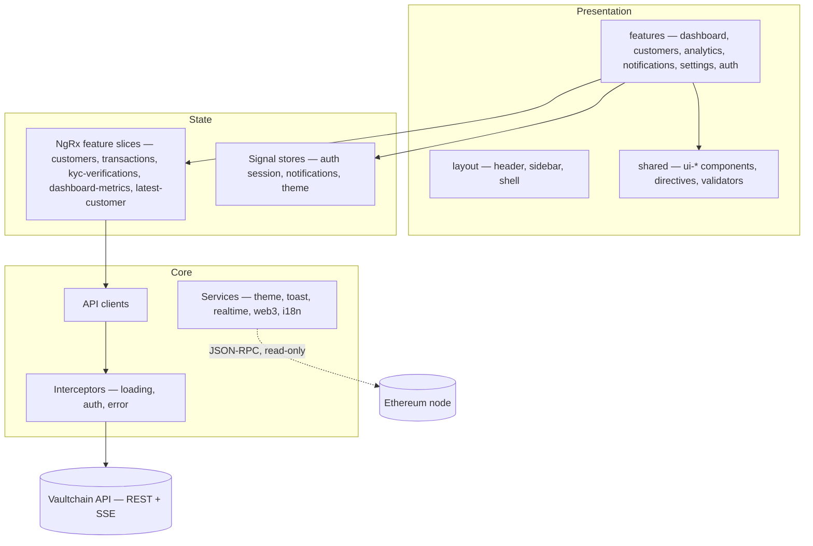

<div align="center">

# Vaultchain — Operations Console (`Web/`)

**The Angular frontend of the Vaultchain monorepo** — the operations console a fintech's
back-office team runs in the browser.

<em>Standalone components · OnPush · lazy routes · signals + NgRx · read-only Web3 · light / dark · TR / EN</em>

<br/>


</div>

> New here? Start with the **[root README](../README.md)** for the whole product — what
> Vaultchain is, how to run the full stack, and the backend behind this UI.

---

## What is this?

This folder is the part of Vaultchain that runs **in the operator's browser**: a single-page
Angular application. Compliance officers, operations analysts, administrators, and auditors sign
in here to look up a customer, check KYC status, follow money movements, and flag risky crypto
wallets — all in one console.

The frontend owns no data. Everything — customers, KYC, wallets, transactions, notifications,
analytics — is read from the Vaultchain API; public blockchain data is read directly from an
Ethereum node, read-only. In engineering terms: standalone components with `OnPush` change
detection, lazy-loaded feature routes, three HTTP interceptors, state split between Angular
signals and NgRx, and a hand-written shared UI library.

## Routes

The app has **15 screen routes**, and **every one of them is lazy-loaded**. Authentication
screens live outside the shell; everything else renders inside the app shell (sidebar + header +
content) behind `authGuard`, with `permissionGuard` layered on where a route needs a specific
permission.

| Route | What it does | Guard |
|---|---|---|
| `/login` | Two-pane sign-in; one-click demo cards for the three roles. | public |
| `/mfa/verify` | MFA (TOTP two-step verification) challenge — the second step after a correct password; reachable only mid-login. | `mfaPendingGuard` |
| `/forgot-password` | On-screen password-reset wizard (email → code → new password). | public |
| `/dashboard` | Portfolio KPIs, verified-KYC breakdown with an as-of stamp, live recent-customers list, trend charts. | `authGuard` |
| `/customers` | Search, KYC/status filters, sorting, pagination — filters sync to the URL. | `authGuard` + `customers.read` |
| `/customers/new` | Customer creation with rich reactive-form validation. | `authGuard` + `customers.manage` |
| `/customers/:id` | Customer 360 — profile, wallet balance and limits, filtered transaction history, KYC + risk history. | `authGuard` + `customers.read` |
| `/customers/:id/edit` | Customer editing with masked sensitive fields. | `authGuard` + `customers.update` |
| `/customers/:id/web3-risk` | Read-only on-chain risk screen: live wallet data + simulated (and labeled) AML signals + a recorded decision. | `authGuard` + `customers.read` |
| `/analytics` | Deeper aggregate views fed by server-side aggregations. | `authGuard` |
| `/notifications` | Recipient-scoped notification feed; mark read / mark all read. | `authGuard` |
| `/settings` | Operator settings shell — Profile, Security, Appearance, Language, Notifications, Access. | `authGuard` |
| `/settings/mfa` | Deep link that opens the MFA setup wizard inside the settings shell (backup codes + trusted devices). | `authGuard` |
| `/settings/admin-mfa-reset` | Admin tool: reset another operator's MFA. | `authGuard` + `auth.mfa.admin_reset` |
| `/admin-password-reset` | Admin password-reset queue. | `authGuard` + `auth.password.admin_reset` |

Legacy paths keep working through redirects: `/admin-reset-requests` redirects to
`/admin-password-reset`, and its old `:id` deep link is carried over as a query parameter. The
bare `/` and any unknown route land on the dashboard.

## Technology

The dependency footprint is deliberately small — no UI kit, no chart library, no blockchain SDK.
Charts and the wei-to-ETH math (`BigInt`, by hand) are written in-house.

| Area | Choice | Version |
|---|---|---|
| Framework | Angular (standalone, signals, `inject()`) | 21.2 |
| Language | TypeScript (strict + strict templates) | 5.9 |
| Reactivity | RxJS | 7.8 |
| Shared state | NgRx (feature-lazy) + Angular signals | 21 |
| i18n | ngx-translate | 17 |
| Styling | Tailwind CSS + SCSS design tokens | 3.4 |
| Unit / component tests | vitest + `@vitest/coverage-v8` + jsdom | 4 |
| End-to-end | Cypress | 15 |

**Deliberately absent:** any second UI framework; animation libraries; prebuilt component kits
(Material / PrimeNG); a chart library; a Web3 SDK (ethers / viem / wagmi). Motion is CSS +
`@angular/animations` only.

## Architecture

Screens depend on state facades and shared UI; state depends on API clients; API clients pass
through interceptors on their way to the server. Chain reads go from one service straight to a
public Ethereum node.



```text
src/app/
├─ core/          # api/ (endpoint clients) · auth/ (guards, session) · interceptors/
│                 # realtime/ (SSE client) · services/ · state/ (root NgRx slices) · http/
├─ features/      # each feature area is a lazy route: dashboard · customers · analytics ·
│                 # notifications · settings · auth
│                 #   └─ pattern: pages/ (routed screens) + components/ (screen-local pieces)
│                 #      + state/ · models/ · services/ where a feature needs them
├─ layout/        # main-layout (shell) · header · sidebar
└─ shared/        # components/ (ui-*) · directives/ · models/ · utils/ · validators/ · animations/
```

**Principles**

- **Standalone + `OnPush` everywhere.** No `NgModule`s; every component declares its own imports.
- **Lazy feature routes.** Every feature area is code-split, so the initial load stays inside
  budget and optional screens (like Web3 risk) load only when visited.
- **Three HTTP interceptors**, in order: **loading** drives the global progress bar; **auth**
  attaches the access token; **error** maps failures to localized toasts and leaves recoverable
  `401`s to the auth interceptor's silent refresh-and-retry.
- **Signals vs NgRx split.** Cross-cutting UI state (session, notifications, theme) lives in
  Angular signals; route-scoped domain data that benefits from effects and selectors (customers,
  transactions, KYC, dashboard metrics) lives in lazily provided NgRx feature slices.
- **A permission directive.** `*appRequirePermission` hides UI the operator is not allowed to
  use — a courtesy only; the server is the authority.

## The shared `ui-*` library

**30 shared `ui-*` primitives** (29 components + 1 directive) live under
`src/app/shared/components`. Each is standalone, `OnPush`, themeable, accessible, and TR/EN
aware — screens compose a consistent vocabulary instead of one-off markup.

| Group | Members |
|---|---|
| Data & layout | `ui-table` (data grid with pagination, sorting, row selection) · `ui-card` · `ui-hero-card` · `ui-stat-card` · `ui-drawer` · `ui-tabs` · `ui-breadcrumb` · `ui-menu` |
| Charts (hand-written) | `ui-chart-bar` · `ui-chart-line` · `ui-chart-donut` · `ui-chart-tip` (shared tooltip panel) |
| Forms & input | `ui-form` · `ui-input` · `ui-select` · `ui-switch` · `ui-checkbox` · `ui-segmented` · `ui-button` |
| Feedback & status | `ui-alert` · `ui-badge` · `ui-empty` · `ui-skeleton` · `ui-progress` · `ui-pagination` · `ui-confirm-dialog` · `ui-toast` · `ui-avatar` · `ui-logo` |
| Directive | `appUiTooltip` (accessible tooltip, in `ui-tooltip/`) |

## Realtime (SSE)

The dashboard, the customers list, and analytics stay live without polling. Everything shares
**one** multiplexed `EventSource` — a single Server-Sent Events connection is opened once and
fanned out to all subscribers.

- **No token in the URL.** The stream is authorized by a short-lived httpOnly cookie; the token
  never appears in a URL, closing the log, history, and `Referer` leak paths.
- **Heartbeat + watchdog.** The server sends a periodic ping; a client-side watchdog treats
  silence as a dead connection.
- **Reconnect with backoff.** Capped exponential backoff; refreshes triggered by stream events
  are debounced.

Client: `src/app/core/realtime/dashboard-stream.service.ts`.

## i18n, theming, accessibility

- **i18n:** **963 translation keys per language (TR / EN), full parity** — a CI parity gate
  fails the build on drift across 620 static references, and the backend error catalog is
  translated 73/73. `LOCALE_ID` (`tr-TR` / `en-US`) drives date, number, and percent formatting.
- **Theming:** light/dark is a `data-theme` switch over the `--color-*` design tokens in
  `src/styles/_tokens.scss`; palettes are checked for AA contrast.
- **Accessibility & motion:** controls are keyboard-reachable, state is never conveyed by color
  alone, a skip link and content landmarks are in place, and `prefers-reduced-motion` is honored
  in component styles.

## Tests and quality

The numbers below are measurements, not targets; the gates break the build.

- **Unit + component:** **124 spec files · 1,609 vitest tests** — components, stores,
  interceptors, validators, and the Web3 boundary (mock EIP-1193 / JSON-RPC; no live wallet or
  RPC in tests).
- **Coverage:** measured **99.65% statements · 98.31% branches · 99.64% functions · 99.86%
  lines**; vitest thresholds hold 97 statements / 98 lines / 97 functions / 94 branches, plus a
  **≥ 90% per-file floor** on all four metrics via `npm run coverage:files:check` (repo root).
- **End-to-end:** Cypress — **13 spec files: 12 offline specs with 29 tests, plus 1 opt-in
  live-contract spec**, run as a **Chrome + Electron** matrix in CI. Offline specs run against
  contract-checked, stateful stubs (`cy.intercept`), so they are deterministic and need no
  backend; the live-contract lane verifies against a real API when armed.
- **Build budgets:** at last measure the production build landed at **563.5 kB initial**,
  against a **650 kB warning / 1 MB error** budget; per-component SCSS is capped at 8 kB
  warning / 18 kB error.
- **Type safety:** strict TypeScript + strict Angular templates; `prettier` and `stylelint` are
  enforced in CI.

E2E lanes map one-to-one to npm scripts:

| Lane | Script (from `Web/`) | What it runs |
|---|---|---|
| Default | `npm run e2e` | Full offline suite in Chrome (alias of `e2e:chrome`). |
| Browser matrix | `npm run e2e:chrome` / `npm run e2e:electron` | The same suite per browser; CI runs both. |
| Cross-browser | `npm run e2e:cross-browser` | Both browsers in one command. |
| Quality smoke | `npm run e2e:quality` | The `quality-smoke` spec only. |
| UX audit | `npm run e2e:audit` | `browser-ux-smoke` with visual artifact capture. |
| Live contract | `npm run e2e:live-contract` | Opt-in contract check against a real backend. |
| Docs screenshots | `npm run e2e:docs-shots` | Regenerates the [screen gallery](../docs/screens.md) images against a live stack (`cypress/docs-screenshots/capture.cy.ts`). |
| Interactive | `npm run e2e:open` | Opens the Cypress runner. |

## Commands

Because the frontend reads everything from the API, you usually want the full stack — from the
repo root:

```bash
npm run setup            # once: dependencies + PostgreSQL in Docker + schema + demo data
npm run dev              # database + API (:3000) + Web (:4200) together
npm run dev:web          # Web only (:4200) — assumes the API is already on :3000
```

From inside this folder (`Web/`):

```bash
npm test                 # vitest — with coverage and thresholds
npx vitest --run         # tests only, no coverage
npm run e2e              # Cypress (Chrome) — needs the dev server on :4200 first: npm start
npm run e2e:open         # open Cypress interactively
npm run format:check     # prettier
npm run lint:styles      # stylelint
npm run build            # production build (budgets enforced)
```

Demo sign-ins are `admin@example.com` / `operator@example.com` / `auditor@example.com` with the
password `Test-Passw0rd!` (local development only). Every way to run the stack, including
Docker, is covered in [../DOCKER.md](../DOCKER.md).

## Related documentation

- [Root README](../README.md) — the whole product
- [Api/README.md](../Api/README.md) — the backend in depth
- [docs/README.md](../docs/README.md) — documentation hub
- [docs/architecture.md](../docs/architecture.md) — system architecture
- [docs/testing-and-quality.md](../docs/testing-and-quality.md) — test strategy and gates
- [DOCKER.md](../DOCKER.md) — running everything in Docker

<div align="center"><sub>Vaultchain · <code>Web/</code> workspace · Angular 21 · read-only Web3 · TR / EN · light / dark</sub></div>
