# Vaultchain Documentation

Vaultchain is the back-office console for fintech operations — an Angular 21 web console and a NestJS 11 (Fastify) API over PostgreSQL 16, built and documented as a portfolio project. This page is the map of the documentation set: pick the reading path that matches your goal, or jump straight to any document from the catalog.

## 🧭 Start here by goal

| Your goal | Read, in order |
| --- | --- |
| **Evaluating in 10 minutes** | [Root README](../README.md) → [Screen gallery](screens.md) → [Architecture](architecture.md) |
| **Running it** | [Getting started](getting-started.md) → [Docker guide](../DOCKER.md) |
| **Understanding the engineering** | [Architecture](architecture.md) → [Data model](data-model.md) → [API reference](api-reference.md) → [Auth & RBAC](auth-and-rbac.md) → [Security model](security-model.md) |
| **Operating or contributing** | [Testing & quality](testing-and-quality.md) → [Deployment & operations](deployment-and-operations.md) → [Contributing guide](../CONTRIBUTING.md) |

```mermaid
flowchart TB
    subgraph P1["Evaluate in 10 minutes"]
        direction LR
        A1["Root README"] --> A2["screens.md"] --> A3["architecture.md"]
    end
    subgraph P2["Run it"]
        direction LR
        B1["getting-started.md"] --> B2["DOCKER.md"]
    end
    subgraph P3["Understand the engineering"]
        direction LR
        C1["architecture.md"] --> C2["data-model.md"] --> C3["api-reference.md"] --> C4["auth-and-rbac.md"] --> C5["security-model.md"]
    end
    subgraph P4["Operate or contribute"]
        direction LR
        D1["testing-and-quality.md"] --> D2["deployment-and-operations.md"] --> D3["CONTRIBUTING.md"]
    end
```

## 📚 Core guides

Everything under `docs/` is a single-topic document; each one ends with links to its closest siblings.

| Document | What it covers |
| --- | --- |
| [getting-started.md](getting-started.md) | Zero to running locally: prerequisites, `npm run setup` and `npm run dev`, demo sign-in, a first tour, troubleshooting. |
| [architecture.md](architecture.md) | System, frontend, and backend architecture in one file: context diagram, monorepo layout, request lifecycle, realtime design, key engineering decisions. |
| [data-model.md](data-model.md) | The PostgreSQL schema: ER diagram, all 26 models by domain, integrity mechanisms (double-entry ledger, optimistic concurrency via rowVersion, hash-chained audit trail, idempotency), seed profile. |
| [api-reference.md](api-reference.md) | The REST contract: code-first OpenAPI with a CI drift gate, 54 paths / 61 operations by family, response envelopes, pagination, idempotency, the SSE stream. |
| [auth-and-rbac.md](auth-and-rbac.md) | Identity: session lifecycle, MFA (TOTP two-step verification), password-reset flows, the three-role RBAC matrix, audited PII reveal. |
| [security-model.md](security-model.md) | Defense in depth: trust boundaries, security headers, input validation, PII encryption, rate limits, supply-chain gates, database roles and RLS status. |
| [testing-and-quality.md](testing-and-quality.md) | The test pyramid with measured counts and coverage, every test lane, the enforced gates, and the CI job map. |
| [deployment-and-operations.md](deployment-and-operations.md) | Local and Docker topology, configuration reference, production hardening, health checks, logging and correlation, the Redis scale-out seam. |
| [roadmap.md](roadmap.md) | The honest engineering roadmap: near-term hardening and later ideas, with no date promises. |
| [screens.md](screens.md) | The screen gallery: all 24 screenshots grouped by journey, with captions and the capture standard. |
| README.md — this page | The navigation hub: goal-based reading paths plus the full catalog. |

## 🗂️ Root and package docs

| Document | What it covers |
| --- | --- |
| [README.md](../README.md) | The project flagship: value proposition, 60-second run, feature tour, quality proof, honest scope. |
| [Web/README.md](../Web/README.md) | Frontend deep dive: routes, state patterns, the `ui-*` component kit, the SSE client, i18n and theming, tests and budgets. |
| [Web/public/fonts/README.md](../Web/public/fonts/README.md) | The self-hosted font inventory: Inter and Space Grotesk, how they are wired, and their SIL OFL attribution. |
| [Api/README.md](../Api/README.md) | Backend deep dive: module map, data-model highlights, API surface, security posture, tests, run commands. |
| [DOCKER.md](../DOCKER.md) | Run the whole stack in Docker: quick start, services, seed-once behavior, configuration. |
| [CONTRIBUTING.md](../CONTRIBUTING.md) | Development workflow: setup, branch and commit conventions, quality gates, the PR process. |
| [Pull request template](../.github/pull_request_template.md) | The structure and quality checklist every pull request description starts from. |
| [SECURITY.md](../SECURITY.md) | Security policy: scope, handling of secrets and PII, how to report a finding. |
| [CHANGELOG.md](../CHANGELOG.md) | Release history in Keep a Changelog format. |
| [CODE_OF_CONDUCT.md](../CODE_OF_CONDUCT.md) | Community standards — the Contributor Covenant. |
| [LICENSE](../LICENSE) | MIT license. |

## 🎯 Source-of-truth pointers

The documents describe; these files decide. When a document and a file disagree, the file wins.

| Question | Authoritative file |
| --- | --- |
| What does the REST API expose? | [`Api/openapi.json`](../Api/openapi.json) — also served live at `/api/v1/docs-json` |
| What does the database look like? | [`Api/prisma/schema.prisma`](../Api/prisma/schema.prisma), plus the SQL backstops under [`Api/prisma/sql/`](../Api/prisma/sql/) |
| What does CI actually run? | [`.github/workflows/ci.yml`](../.github/workflows/ci.yml) |
| What bundle sizes are allowed? | [`Web/angular.json`](../Web/angular.json) production budgets |
| What coverage is enforced? | [`Web/vitest.config.ts`](../Web/vitest.config.ts) and [`Api/package.json`](../Api/package.json) thresholds, plus [`scripts/check-file-coverage.mjs`](../scripts/check-file-coverage.mjs) per file |

## 🔗 See also

- [Root README](../README.md) — the 90-second overview
- [Web/README.md](../Web/README.md) — frontend deep dive
- [Api/README.md](../Api/README.md) — backend deep dive
