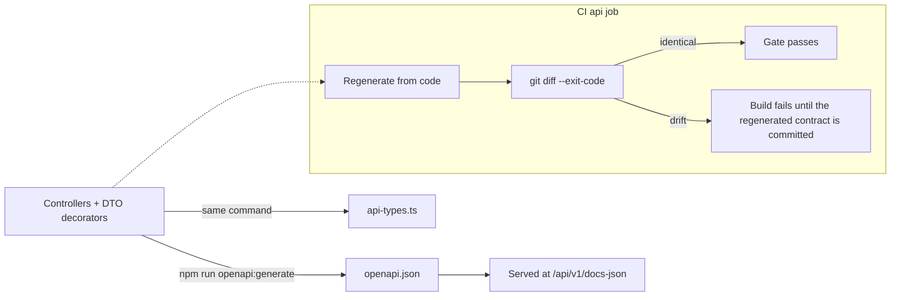

# API Reference

The REST contract of the Vaultchain backend: how the OpenAPI document is produced and kept honest, what the surface looks like, and the envelope, pagination, and idempotency rules every endpoint shares. Written for engineers integrating against the API or reviewing a contract change.

## Contract philosophy: code-first, committed, drift-gated

There is no hand-maintained specification. The OpenAPI 3.0 document is generated **code-first with `@nestjs/swagger`** — controller route decorators and `class-validator` DTOs are the single source of truth for every path, schema, and status code. Two artifacts are committed to the repository and reviewed like any other code:

- [`Api/openapi.json`](../Api/openapi.json) — the canonical machine-readable contract (title `Fintech Dashboard API`, version `1.0`).
- [`Api/src/generated/api-types.ts`](../Api/src/generated/api-types.ts) — TypeScript types derived from the spec with `openapi-typescript`.

CI enforces that the committed contract and the code never drift apart. The `api` job in [`ci.yml`](../.github/workflows/ci.yml) regenerates both artifacts and fails on any difference:

```bash
npm run openapi:generate
git diff --exit-code -- openapi.json src/generated/api-types.ts
```

A contract change therefore cannot ship silently: the PR that changes a controller must also carry the regenerated spec, which makes every contract change explicit in review. The offline Cypress end-to-end suite reuses the same committed spec to contract-check its stubbed responses.



## Surface at a glance

| Fact | Value |
| --- | --- |
| Title / version | `Fintech Dashboard API` / `1.0` |
| Base path | `/api/v1` (global prefix; the version lives in the URL) |
| Size | **54 paths / 61 operations** |
| Methods | GET 25 · POST 28 · DELETE 4 · PATCH 3 · PUT 1 |
| Auth | `Authorization: Bearer <access-token>` unless a route is explicitly public |
| Format | JSON, camelCase on the wire; money as integer minor units, never floats |

Breaking changes require a new version prefix; additive changes (new optional fields, new endpoints) evolve `/api/v1` in place.

## Endpoint families

| Family | Paths | Purpose |
| --- | --- | --- |
| `auth` | 23 | Session lifecycle (login, refresh, logout, `me`), the full MFA (TOTP two-step verification) surface (enrollment, verification, backup codes, trusted devices, admin reset), and both password-reset flows (self-service wizard + administrator-approved queue) |
| `customers` | 9 | Customer CRUD, KYC verification history, data-minimized credential preview, risk screenings and decisions, per-customer wallet (with limit updates) and transaction history |
| `dashboard` | 6 | Server-side KPI summary, KYC distribution, latest and recent customers, plus the SSE live stream and its cookie-minting token endpoint |
| `operator` | 5 | Operator profile and the recipient-scoped notification feed with preferences |
| `roles` | 3 | Role list and creation, permission attach and detach |
| `users` | 3 | Admin user list, role assignment and removal |
| `health` | 1 | Public liveness probe (also used by the Docker health check) |
| `catalog` | 1 | Reference data — supported currencies |
| `permissions` | 1 | The permission dictionary |
| `transactions` | 1 | Idempotent, double-entry ledger posting |
| `metrics` | 1 | Daily metric series behind the analytics screen |

Authorization is permission-code based — see [Authentication and RBAC](auth-and-rbac.md) for which role can call what.

## Response envelopes

Every JSON response uses one of three shapes, produced centrally (a global interceptor for success, a global exception filter for errors), so clients never guess.

**Single resource** — data plus a correlation id:

```json
{
  "data": { "id": "0198c1c0-6f2a-7d31-b1e0-3a5d9e2f4c88", "kycStatus": "VERIFIED" },
  "meta": { "correlationId": "8f6f2a1e-4c0b-4c8e-9f2d-7b1a5e3d9c40" }
}
```

**Paginated list** — adds a `page` block:

```json
{
  "data": [],
  "page": { "number": 1, "size": 25, "totalItems": 1500, "totalPages": 60 },
  "meta": { "correlationId": "8f6f2a1e-4c0b-4c8e-9f2d-7b1a5e3d9c40" }
}
```

**Error** — a single stable shape with a machine-readable code:

```json
{
  "error": {
    "code": "Validation.Failed",
    "message": "Request validation failed.",
    "details": ["fullName must be longer than or equal to 3 characters"],
    "correlationId": "8f6f2a1e-4c0b-4c8e-9f2d-7b1a5e3d9c40"
  }
}
```

Rules the implementation guarantees:

- **Correlation** — clients may send `X-Correlation-Id`; if absent the server generates a UUID. The same value appears in `meta` and `error`, and in server logs, so one id traces a request end to end.
- **Codes over prose** — domain errors carry stable codes such as `Auth.AccountLocked`, `Idempotency.KeyConflict`, `Resource.NotFound`, or `Database.Unavailable`. The web app translates the backend error catalog (73 codes) into both UI languages.
- **No leaks** — unknown internal errors return a generic `Internal.Error` envelope; stack traces and ORM details stay in server logs.
- **`details` only when useful** — validation failures list the offending constraints; other errors omit the field.
- SSE responses are exempt: the envelope interceptor passes `text/event-stream` through untouched so event framing is never wrapped.

## Pagination, filtering, sorting

List endpoints share query-based pagination:

| Parameter | Rules |
| --- | --- |
| `page[number]` | integer, minimum 1, default 1 |
| `page[size]` | integer, 1–100, default 25 |
| `filter[...]` | exact-match filters, e.g. `filter[kycStatus]`, `filter[status]`, `filter[active]`, plus free-text `filter[q]` on the customer list |
| `sort` | field allowlist per endpoint |
| `reveal` | customer routes only — see the audited PII reveal in [Authentication and RBAC](auth-and-rbac.md) |

Responses echo the effective paging in the `page` block (`number`, `size`, `totalItems`, `totalPages`).

## Idempotency on money writes

`POST /api/v1/transactions` requires an `Idempotency-Key` header (a UUID). The service fingerprints the canonicalized request body with SHA-256 and tracks each key through `IN_PROGRESS` to `COMPLETED` — and, critically, the idempotency record is committed **in the same database transaction** as the ledger posting, so a retry can never double-post.

| Scenario | Result |
| --- | --- |
| Header missing | `400 Idempotency.KeyRequired` |
| Header is not a UUID | `400 Idempotency.KeyInvalid` |
| First use | Ledger posts; the key is stored `COMPLETED` with the response body, atomically |
| Same key + same body | The stored response is returned verbatim; nothing posts twice |
| Same key + different body | `409 Idempotency.KeyConflict` |
| Same key while the first attempt is still running | `409 Idempotency.InFlight` |
| Key older than 24 hours | The stored response is still replayed — a 24-hour `expiresAt` is recorded (and indexed) for a future cleanup sweep, but it is not yet enforced on read, so an old key does not expire or become reusable |
| `IN_PROGRESS` left behind by a crashed process | Reclaimed after a staleness window so legitimate retries are not wedged |

## The live stream (SSE)

Dashboard, analytics, and customer-list screens update over one shared **Server-Sent Events** stream instead of polling. Because `EventSource` cannot send an `Authorization` header, the stream has a two-step, cookie-based handshake — both operations are part of the OpenAPI surface:

1. `POST /api/v1/dashboard/stream-token` (normal Bearer auth) mints a 60-second, minimally scoped credential and sets it as the httpOnly **`ftd_stream`** cookie. The credential carries only the subject and a `stream:read` scope — never the operator's full permission set — and is never exposed to JavaScript or URLs.
2. `GET /api/v1/dashboard/stream` opens the `text/event-stream`, authenticated by that cookie. Events are recipient-scoped (each operator receives only their own notifications), and the server sends a keep-alive ping every 25 seconds so idle connections and proxies stay healthy.

The browser opens a single `EventSource` for the whole app and reconnects with a fresh token and capped exponential backoff after any drop.

## Browsing and regenerating the contract

- **Browse** — the running API serves the spec at `/api/v1/docs-json` (the interactive Swagger UI is deliberately not bundled). Import that URL — or the committed [`Api/openapi.json`](../Api/openapi.json) — into Swagger UI, Insomnia, or any OpenAPI viewer.
- **Regenerate** — after changing a controller or DTO, run the generator inside `Api/` and commit the result:

```bash
npm run openapi:generate
```

This executes `ts-node scripts/generate-openapi.ts && openapi-typescript openapi.json -o src/generated/api-types.ts` — the exact artifacts the CI drift gate checks.

## See also

- [Documentation hub](README.md)
- [Authentication and RBAC](auth-and-rbac.md) — who can call what, and how sessions work
- [Data model](data-model.md) — the schema behind these payloads
- [Architecture](architecture.md) — request lifecycle and realtime design
