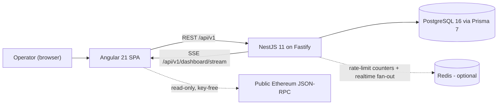
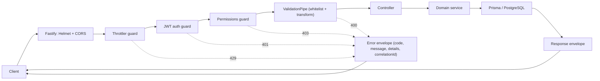

# Architecture

How Vaultchain is put together: the system context, the monorepo layout, the frontend and backend architectures, the realtime design, and the engineering decisions behind them — with the reasoning, not just the shape. Written for engineers who want to understand the codebase before diving in.

## System context

The browser runs an Angular single-page application. Every domain rule, permission check, and persistence operation lives behind the NestJS API under `/api/v1`; the SPA is presentation and orchestration only. Live dashboard updates flow back over a single Server-Sent Events stream. Web3 risk screening reads public Ethereum data through key-free, read-only JSON-RPC calls from the SPA ([`web3.service.ts`](../Web/src/app/core/services/web3.service.ts)); the resulting risk decisions are persisted through the backend like any other write.

Trust boundaries follow the arrows: the backend is the sole authority for authentication, authorization, validation, money movement, and audit. The Ethereum link is read-only and non-custodial — no keys exist anywhere in the system. Redis is optional: without `REDIS_URL` the API runs self-contained with in-memory equivalents (see [Realtime design](#realtime-design)).

## Monorepo layout

| Path | Contents |
| --- | --- |
| `Web/` | Angular 21 frontend, its Vitest suite, and the Cypress end-to-end suite |
| `Api/` | NestJS 11 backend, Prisma schema and SQL, seed script, committed [`openapi.json`](../Api/openapi.json) |
| `docs/` | This documentation set and all screenshots |
| `scripts/` | Zero-dependency Node tooling: setup/dev orchestration and the quality gates |
| `.github/` | The single CI workflow ([`ci.yml`](../.github/workflows/ci.yml)) and repo templates |
| `docker-compose.yml` + `docker-compose.override.yml` | Full-stack container run; the override adds host port publishing and one-shot seed |

The backend emits one authoritative OpenAPI document from source. CI regenerates it and the derived
`Api/src/generated/api-types.ts` to block drift; frontend API contracts are currently maintained
locally and do not yet consume the generated types.

## Frontend architecture

The frontend is a standalone-component Angular 21 application — no NgModules — with `OnPush` change detection as the default and feature code organized under `core/`, `features/`, `layout/`, and `shared/`.

### Routing

Fifteen screen routes are lazy-loaded (plus the authenticated shell and 4 redirects): `/login`, `/mfa/verify`, `/forgot-password`, `/dashboard`, `/customers`, `/customers/new`, `/customers/:id`, `/customers/:id/edit`, `/customers/:id/web3-risk`, `/analytics`, `/notifications`, `/settings`, `/settings/mfa`, `/settings/admin-mfa-reset`, and `/admin-password-reset`. Three functional guards protect them: `authGuard` (session required), `mfaPendingGuard` (the MFA (TOTP two-step verification) screen is reachable only mid-login), and `permissionGuard` parameterized by permission code (`customers.read`, `customers.manage`, `customers.update`, `auth.mfa.admin_reset`, `auth.password.admin_reset`). Guards are UX — the backend re-enforces every permission on every request.

### State: NgRx where it pays, signals where it does not

State management is deliberately split by the shape of the state, not by fashion:

| State | Tool | Why |
| --- | --- | --- |
| Dashboard metrics, latest customer, customers list, transactions, KYC verifications | NgRx (5 reducer slices, providers registered lazily per route) | Shared async server state benefits from actions, effects, devtools time-travel, and testable reducers |
| Auth session, notifications, theme | Signal stores | App-local, mostly synchronous state — a signal is simpler, faster, and needs no action ceremony |

### HTTP layer

Three functional interceptors compose the HTTP pipeline:

1. **Auth** — attaches the in-memory Bearer access token; on a 401 it transparently rotates the token via the refresh endpoint and retries the original request once, and only clears the session if the refresh itself fails. It skips login/refresh/logout and anything outside the API base (such as Web3 RPC reads).
2. **Error** — funnels failed responses into a central error service, which maps the backend error envelope (`code`, `message`, `details`, `correlationId`) to translated user-facing notifications; requests can opt out for flows that handle errors locally.
3. **Loading** — drives the global progress state around every in-flight request, with a header-based opt-out.

### UI kit

`shared/components` contains a hand-built `ui-*` kit of 30 primitives (29 components + 1 directive): alert, avatar, badge, breadcrumb, button, card, bar/donut/line charts with a shared chart tip, checkbox, confirm-dialog, drawer, empty state, form, hero-card, input, logo, menu, pagination, progress, segmented control, select, skeleton, stat-card, switch, table, tabs, toast, and a tooltip directive. The charts are hand-written SVG components — no chart library — which keeps the bundle small and every pixel theme-aware.

### Realtime client

The SSE client ([`dashboard-stream.service.ts`](../Web/src/app/core/realtime/dashboard-stream.service.ts)) multiplexes one `EventSource` to all subscribers. It re-authorizes with a fresh cookie and reconnects on drop with capped exponential backoff (15-second ceiling), resets the backoff after a successful event, and treats a stalled heartbeat as a dead connection so half-open sockets never leave the dashboard silently frozen.

### i18n and theming

All copy lives in ngx-translate JSON catalogs — 963 leaf keys each for English and Turkish, with full parity enforced in CI by `npm run i18n:check`. The backend returns i18n *keys* for errors and notifications; the frontend owns all rendered copy. Theming is a light/dark system built on SCSS design tokens with Tailwind CSS 3 utilities, switched by a signal-backed theme service.

## Backend architecture

The backend is NestJS 11 on the Fastify adapter. Bootstrap ([`main.ts`](../Api/src/main.ts)) sets the global `/api/v1` prefix, Helmet security headers (CSP `default-src 'none'`, `frame-ancestors 'none'`; HSTS in production), a CORS allowlist from `CORS_ORIGINS` with credentials, and a global `ValidationPipe` with `whitelist`, `forbidNonWhitelisted`, and `transform` — unknown fields are rejected, not ignored.

### Modules and controllers

13 domain modules under `Api/src/modules` expose 20 controllers (19 module controllers plus the health controller under `common/`):

| Module | Controllers | Responsibility |
| --- | --- | --- |
| `auth` | auth, mfa, mfa-account | Login, logout, token refresh, session lifecycle, and the MFA verification, enrollment, and management endpoints |
| `mfa` | — | No controllers: provides the TOTP, backup-code, challenge, and trusted-device services (plus the challenge guard) that the `auth` controllers consume |
| `password-reset` | password-reset, password-reset-admin, password-reset-request, password-reset-request-admin | Self-service MFA-gated reset plus the admin-approval queue |
| `rbac` | rbac | Roles, permissions, user-role assignment |
| `customers` | customers | Customer CRUD, KYC history, PII reveal |
| `transactions` | transactions, customer-transactions | Money movement and per-customer transaction reads |
| `wallets` | wallets | Wallet and balance reads |
| `analytics` | analytics, metrics | Dashboard aggregates and time-series metrics |
| `risk` | risk | Web3 risk assessments and signals |
| `notification` | notification | Per-recipient notification feed and read-state |
| `operator` | operator | Operator profile and settings |
| `catalog` | catalog | Reference data such as currencies |
| `realtime` | realtime | The SSE stream and its cookie authorization |
| `common/health` | health | Liveness endpoint |

The surface adds up to 54 paths / 61 operations, all described in [`openapi.json`](../Api/openapi.json) — see [API reference](api-reference.md).

### Request lifecycle

Rate limits are enforced before authentication: 100 requests/min/IP globally, 10/min on auth endpoints, 30/min on customer writes. Every failure path exits through the same error envelope, and the `correlationId` in it matches the structured (pino) request logs — one ID traces a request across browser, API, and audit trail.

### Configuration fail-fast

The API refuses to boot in production with unsafe configuration: JWT secrets shorter than 32 characters, a missing explicit CORS allowlist, or a disabled throttler each abort startup. Misconfiguration is a crash at deploy time, not a silent weakness at runtime.

## Realtime design

Realtime is deliberately minimal: **one** SSE stream, `GET /api/v1/dashboard/stream`, carrying dashboard KPI updates and customer-list events.

- **Authorization** — the stream is authorized by a dedicated httpOnly cookie (`ftd_stream`), so no token ever appears in a URL and the browser's native `EventSource` works without header hacks.
- **Single-process default** — events flow through an in-process RxJS Subject. No broker, no infrastructure to run locally.
- **Optional scale-out** — setting `REDIS_URL` switches rate-limit counters to shared Redis storage and bridges realtime events across instances via pub/sub (channel `ftd:realtime:dashboard`). Redis failures degrade features; they never crash the API.

This is the "pay for scale only when you scale" seam: the local demo and a multi-instance deployment run the same code path with one environment variable of difference.

## Engineering decisions

The decisions that shape the codebase, with the reasoning:

| Decision | Why |
| --- | --- |
| Integer minor units (`BigInt`) + double-entry ledger | Floating point cannot represent money exactly. Every transaction posts balanced DEBIT/CREDIT legs, so the books always sum to zero and any balance can be recomputed from first principles |
| `Idempotency-Key` persisted in the same DB transaction as the money movement | A retried request must not double-post. Because the key record and the ledger rows commit atomically, a replay finds the key and returns the stored response — and a `UNIQUE` constraint on `transactions.idempotency_key` backstops the guarantee at the database level |
| Optimistic concurrency (`rowVersion`) on Customer and Wallet | Two operators editing the same record is a normal day in a back office. A stale write is rejected with a conflict instead of silently overwriting the newer data |
| Hash-chained audit trail | Each audit row stores `prev_hash` and `entry_hash` (SHA-256 over the previous hash and the canonicalized payload), with appends serialized on a PostgreSQL advisory lock. Rewriting or deleting history breaks the chain visibly |
| In-memory access token (15 min) + rotating refresh cookie | Nothing long-lived is readable by JavaScript: the access token lives only in memory, and the refresh token is an httpOnly `SameSite=Strict` cookie, Argon2id-hashed at rest and rotated on every use — reuse of a stale token kills the whole session family |
| Code-first OpenAPI with a CI drift gate | The contract is generated from controllers and committed; CI regenerates it and fails on any diff (`openapi:generate` + `git diff --exit-code`). The spec, the code, and the frontend's generated types cannot drift apart |
| Versioned Prisma migrations + SQL backstops | A system that moves money needs a schema history that can be reviewed and replayed, so every change is a committed migration; the invariants a migration cannot express (CHECK constraints, partial unique indexes, DB roles) live in idempotent SQL files applied on every provision — see [Data model](data-model.md) |

## See also

- [Documentation hub](README.md)
- [Data model](data-model.md)
- [API reference](api-reference.md)
- [Security model](security-model.md)
