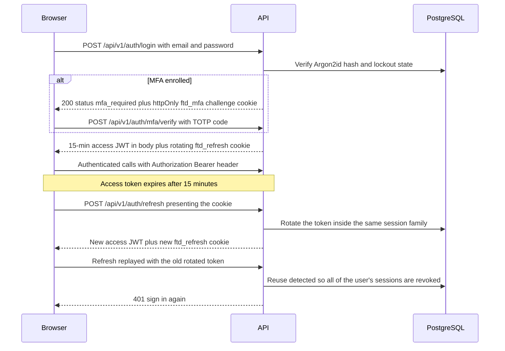

# Authentication and RBAC

How Vaultchain establishes identity and decides what each operator may do: the session lifecycle, MFA (TOTP two-step verification), both password-reset flows, and the three-role permission model. Everything described here is enforced server-side; the UI only mirrors it.

## Session lifecycle

A session is two credentials with very different lifetimes, kept in places XSS cannot reach together:

- **Access token** — a JWT valid for **15 minutes**, carrying the principal's effective permission codes. The browser keeps it **in memory only**; it is never written to a cookie or web storage.
- **Refresh token** — an opaque `rt_<id>.<secret>` value in the httpOnly **`ftd_refresh`** cookie (`SameSite=Strict`, path-scoped to `/api/v1/auth`, `Secure` in production). Only its Argon2id hash is stored server-side. The session family lives 30 days.

Refresh tokens **rotate on every use**. Presenting an already-rotated token is treated as replay and revokes **all of the user's active sessions across every family** — a stolen refresh token dies the moment either party uses it twice. (Ordinary logout, by contrast, revokes only its own session family.)

Additional guarantees around sign-in:

- **Account lockout** — 5 consecutive failed logins lock the account for 15 minutes (`423 Auth.AccountLocked`); a successful login resets the counter.
- **No user enumeration** — wrong email and wrong password produce the same generic error; every attempt is recorded with a hashed IP.
- **Throttling** — login and refresh sit in the 10-requests-per-minute-per-IP auth class.
- **Logout** — revokes the session family server-side and clears the cookie; idempotent.

### Credential cookies

All credential material that must survive a page load rides in httpOnly cookies — JavaScript can read none of these:

| Cookie | Carries | Notes |
| --- | --- | --- |
| `ftd_refresh` | Rotating refresh token | `SameSite=Strict`, path `/api/v1/auth`, 30-day family |
| `ftd_mfa` | Single-use MFA login/enrollment challenge (`mfa_<id>.<secret>`) | Short-lived, attempt-capped, Argon2id-hashed server-side |
| `ftd_remember` | Optional trusted-device token | Set only on request; revoked on password change, MFA disable, or admin reset |
| `ftd_pwreset` | Self-service password-reset challenge | Set only for MFA-confirmed accounts; path-scoped to `/api/v1/auth` |
| `ftd_pwreq` | Admin-approval reset-request handle | Real or structurally identical decoy — responses are byte-identical for every account state |
| `ftd_stream` | 60-second SSE stream credential (`stream:read` scope) | `SameSite=Lax` by design, path `/api/v1/dashboard` — see the [API reference](api-reference.md) |

`SameSite=Strict` on these path-scoped cookies is the CSRF control for the cookie-authenticated endpoints — with one deliberate exception. `ftd_stream` ships `SameSite=Lax` because `EventSource` must present it on the stream's GET handshake; the looser setting is compensated by the credential itself, which lives 60 seconds, carries only the `stream:read` scope, and is path-scoped to `/api/v1/dashboard`. Everything else is Bearer-token authenticated and carries no ambient credentials.

## MFA (TOTP two-step verification)

MFA is **opt-in** per operator and implemented with `otplib` (RFC-6238 TOTP, 30-second steps).

- **Enrollment** — `POST /auth/mfa/setup/start` re-authenticates the password, stores an *inactive* encrypted secret, and returns the `otpauth://` URI plus a QR code for the authenticator app. `POST /auth/mfa/setup/confirm` verifies the first code and activates enrollment. The shared secret is **AES-256-GCM envelope-encrypted** at rest and never returned to the client after setup.
- **Backup codes** — activation issues **10 single-use backup codes** (`XXXXX-XXXXX` format). Only their Argon2id hashes are stored; the plaintext is shown exactly once. `POST /auth/mfa/backup-codes/regenerate` replaces the set.
- **Login challenge** — a password-correct login for an enrolled account returns `mfa_required` with **no tokens** and sets the single-use `ftd_mfa` challenge cookie. The operator completes it at `POST /auth/mfa/verify` (TOTP) or `POST /auth/mfa/backup-code/verify` (backup code). Challenges are attempt-capped per challenge — deliberately *not* a persistent per-account lock, so an attacker cannot lock a victim out of MFA.
- **Replay defense** — the accepted TOTP time-step is persisted (`lastUsedTotpStep`); a code whose step was already used is rejected even inside the validity window. Backup-code redemption is atomically single-use.
- **Trusted devices** — at verification the operator may opt in to remember the browser (`ftd_remember` cookie), skipping the challenge on that device. `GET /auth/mfa/devices` lists remembered devices; `DELETE /auth/mfa/devices/{id}` revokes one. All trusted devices are revoked on password change, MFA disable, and admin reset.
- **Disable / admin reset** — `POST /auth/mfa/disable` (re-authenticated) turns MFA off for the caller. `POST /auth/mfa/admin-reset` lets an Administrator reset an operator's enrollment; it requires the `auth.mfa.admin_reset` permission and writes an audit record.

## Password reset

Two flows cover both self-service and the cases self-service cannot reach. Neither depends on email delivery — the product is honest about that: the "email" step collects the account address on screen and the second factor proves ownership.

**Self-service (three-step wizard, MFA-gated).** Available to accounts with confirmed MFA:

1. `POST /auth/password/reset/initiate` — always answers `202 { "status": "reset_initiated" }` regardless of whether the account exists (no enumeration); the `ftd_pwreset` challenge cookie is set only for an MFA-confirmed account. Throttled at 5 per minute per IP.
2. `POST /auth/password/reset/verify-code` — verifies the TOTP or backup code once and stamps `factor_verified_at` on the challenge. Idempotent; no tokens issued.
3. `POST /auth/password/reset/verify` — accepts the new password only, and only after the factor stamp (`Auth.ResetFactorRequired` otherwise). Success changes the password, revokes **all** sessions, trusted devices, and open challenges, and does not auto-login.

**Administrator-approved queue.** For operators who cannot self-serve (no MFA enrolled, lost device):

- `POST /auth/password/reset-request` — public, throttled at 3 per minute per IP. Always answers `202` and always sets an `ftd_pwreq` cookie — a real handle for a fresh request, a structurally identical decoy otherwise, so responses stay byte-identical for every account state.
- The requester polls `POST /auth/password/reset-request/status` (a POST because claiming is a side effect). Once an Administrator approves, the poll sets a pre-stamped `ftd_pwreset` challenge and the operator finishes through the same `verify` endpoint.
- Administrators work the queue with `GET /auth/password/reset-requests`, `GET /auth/password/reset-requests/{id}`, and the `approve` / `deny` actions.
- As a last resort, `POST /auth/password/admin-reset` lets an Administrator set a working password directly; it requires `auth.password.admin_reset` and is audited.

## RBAC: three roles, seventeen permission codes

Authorization is **permission-code based** (`resource.action`, no wildcards). Roles are just named bundles of codes; the seed provisions three:

| Permission | Administrator | Compliance Officer | Viewer |
| --- | :---: | :---: | :---: |
| `customers.read` | ✅ | ✅ | ✅ |
| `customers.manage` (create) | ✅ | ✅ | — |
| `customers.update` | ✅ | — | — |
| `customers.delete` (soft delete) | ✅ | — | — |
| `customers.pii.reveal` | ✅ | — | — |
| `wallets.read` | ✅ | ✅ | ✅ |
| `wallets.manage-limits` | ✅ | ✅ | — |
| `transactions.read` | ✅ | ✅ | ✅ |
| `transactions.create` | ✅ | ✅ | — |
| `kyc.read` | ✅ | ✅ | ✅ |
| `kyc.manage` | ✅ | ✅ | — |
| `roles.read` | ✅ | ✅ | ✅ |
| `roles.manage` | ✅ | — | — |
| `permissions.manage` | ✅ | — | — |
| `users.manage` | ✅ | — | — |
| `auth.mfa.admin_reset` | ✅ | — | — |
| `auth.password.admin_reset` | ✅ | — | — |

The demo identities map one-to-one: `admin@example.com` (Administrator), `operator@example.com` (Compliance Officer), `auditor@example.com` (Viewer). A seed-time invariant test asserts the permission dictionary equals the union of the role grants, so the matrix above cannot silently drift from what the seed provisions.

### Enforcement model

- **Default deny** — `JwtAuthGuard` is registered globally; every route requires a valid access token unless explicitly marked `@Public()` (login, health, the reset entry points).
- **Permission codes at the route** — controllers declare `@RequirePermissions(...)`; the guard requires **all** listed codes from the JWT's permission claim. A missing code yields `403` without detailing which permission was absent.
- **UI is courtesy** — the web app hides controls and guards routes by permission, but that is convenience for the operator, not security. The API is the sole enforcement point.

### Audited PII reveal

Customer PII (name, email, phone, wallet number, address) is **masked by default** in every response. Unmasking requires two things at once:

1. the caller holds `customers.pii.reveal` — a response-scope permission consumed by the mapper, deliberately not a separate route; and
2. the request opts in explicitly with `?reveal=true`.

Without the permission the flag is silently ignored (masking stays on), and every *effective* reveal writes an audit record. The national ID is stricter still: it is never decrypted on any read path — both masked and revealed responses show only the last four digits. See the [security model](security-model.md) for the encryption details.

## See also

- [Documentation hub](README.md)
- [Security model](security-model.md) — encryption, audit chain, rate limits, fail-fast boot
- [API reference](api-reference.md) — the full endpoint surface these rules protect
- [Screens](screens.md) — the login, MFA, and reset journeys as the operator sees them
