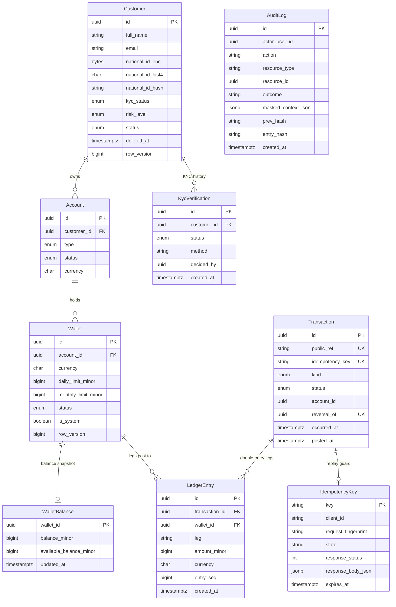

# Data Model

The persistence layer: PostgreSQL 16 accessed through Prisma 7, with a single declarative schema at [`Api/prisma/schema.prisma`](../Api/prisma/schema.prisma) — 26 models and 14 native enums covering identity, authentication, customers, money movement, risk, notifications, and governance. This page explains the schema strategy, the core entities, and the integrity mechanisms that keep the money honest.

## Schema strategy: versioned migrations plus SQL backstops

The schema is versioned. Every change is a reviewable migration under
[`Api/prisma/migrations/`](../Api/prisma/migrations), replayed in order by `prisma migrate deploy`
— the same command the local dev flow, the Docker `db-init` job, and each integration-test container
run. A schema that only ever gets *pushed* cannot be audited, rolled forward on a live database, or
reasoned about after the fact; for a system that moves money, that is not an acceptable trade.

| Task | Command (from `Api/`) |
| --- | --- |
| Apply the committed migrations | `npm run migrate:deploy` |
| Author a migration after editing `schema.prisma` | `npm run migrate:dev` |
| Inspect what has been applied | `npm run migrate:status` |
| Drop and rebuild the local database | `npm run migrate:reset` (destructive, or `npm run db:reset` from the repo root) |

`migrate:deploy` runs [`scripts/db-deploy.mjs`](../Api/scripts/db-deploy.mjs) rather than the bare
Prisma command. A database created before the migrations existed already carries the schema but no
`_prisma_migrations` ledger, so Prisma refuses it with `P3005`. Instead of demanding that the
operator drop their data, the script baselines that database — marking the migrations the live
schema already represents as applied — and deploys again. A genuinely fresh database never reaches
that branch.

Baselining is only safe when the live schema really *is* those migrations, so the script proves it
first with `prisma migrate diff`. The check is deliberately one-directional: a healthy database
holds objects the schema never declares — the `integrity.sql` constraints and the `metric_daily`
rollup — and those are fine. A database that is *missing* something the schema requires is refused
with an explicit instruction to rebuild, because silently marking it up to date would hide the drift
until a query failed at runtime. `migrate:reset` is the destructive escape hatch — and Prisma 7
additionally refuses to run it on behalf of an AI agent without recorded human consent.

Migrations create tables but cannot express every invariant, so three idempotent SQL files back them
up:

| File | Applied by | What it adds |
| --- | --- | --- |
| [`integrity.sql`](../Api/prisma/sql/integrity.sql) | `npm run prisma:integrity` (from `Api/`) — and automatically by both the local dev flow and the Docker `db-init` job | CHECK constraints (ledger leg values, positive amounts, system-wallet purpose coupling), the `transaction_public_ref_seq` sequence, and partial unique indexes |
| [`db-security.sql`](../Api/prisma/sql/db-security.sql) | `npm run prisma:security` (from `Api/`) — a deploy-time step | Least-privilege DB roles (`migrator`, `app_rw`, `audit_writer`, `readonly_analytics`), append-only REVOKE on the audit table, and row-level security policies (enforcement is default-off behind `DB_RLS_ENFORCED`) |
| [`audit-m9-customer-search-index.sql`](../Api/prisma/sql/audit-m9-customer-search-index.sql) | DB-ops step | `pg_trgm` GIN indexes so case-insensitive substring search over customer name and email is index-backed instead of a sequential scan |

## Core entities

The diagram shows the money and customer-identity core — the models where correctness matters most. The remaining models are inventoried in the next section.

Two reading notes: the `Transaction`-to-`IdempotencyKey` link is by key value (application record plus a database `UNIQUE` backstop), not a foreign key; and `AuditLog` stands alone here because its actor relation points at `User`, which lives in the identity domain below. Ids on rows created at runtime are UUIDv7, minted in the application layer rather than by a database default (the dev seed mints random UUIDv4s, and the `IdempotencyKey` primary key is the caller-supplied key string); money is always integer minor units (`BigInt`); timestamps are `timestamptz`.

## Full model inventory

All 26 models, grouped by domain:

| Domain | Model | Purpose |
| --- | --- | --- |
| Identity and RBAC | `User` | Operator account: Argon2id password hash, status, MFA (TOTP two-step verification) fields, `permissionVersion` so a role change invalidates outstanding access tokens immediately |
| Identity and RBAC | `Role` | Named role (administrator, operator, auditor) |
| Identity and RBAC | `Permission` | Permission dictionary entry — `resource.action` codes |
| Identity and RBAC | `UserRole` | User-to-role assignment |
| Identity and RBAC | `RolePermission` | Role-to-permission grant |
| Auth sessions and MFA | `RefreshToken` | Rotating refresh token: Argon2id-hashed secret, session family id, rotation-chain breadcrumb |
| Auth sessions and MFA | `MfaChallenge` | Single-use second-factor challenge between password check and session grant, with attempt limits |
| Auth sessions and MFA | `BackupCode` | Argon2id-hashed single-use recovery codes, shown once at generation |
| Auth sessions and MFA | `RememberedDevice` | Optional trusted device that skips the TOTP prompt until expiry, revocable per device |
| Auth sessions and MFA | `LoginAttempt` | Success/failure log with hashed identifiers, never raw IPs |
| Password reset | `PasswordResetChallenge` | Single-use MFA-gated reset challenge; the password change is gated on a stamped `factor_verified_at` |
| Password reset | `PasswordResetRequest` | Admin-approval reset queue entry; at most one open request per account |
| Customer and KYC | `Customer` | Profile, encrypted national ID, KYC/risk/lifecycle status, soft delete, `rowVersion` |
| Customer and KYC | `KycVerification` | Append-only KYC decision history |
| Money movement | `Currency` | ISO-4217 reference data with per-currency scale |
| Money movement | `Account` | Customer account: type, status, currency |
| Money movement | `Wallet` | Per-currency wallet with daily/monthly limits and `rowVersion`; system wallets carry clearing/revenue legs |
| Money movement | `WalletBalance` | One-to-one balance snapshot, updated in the same transaction as the ledger posting |
| Money movement | `Transaction` | Money-movement header: kind, status, idempotency key, human-facing public ref, reverse-once link |
| Money movement | `LedgerEntry` | Append-only double-entry leg: DEBIT or CREDIT, positive minor units, per-wallet sequence |
| Money movement | `IdempotencyKey` | Stored request fingerprint and response for replay-safe retries |
| Risk | `RiskAssessment` | Web3 screening decision per customer address, with an explicit `isSimulated` honesty flag |
| Risk | `RiskSignal` | Individual signal behind an assessment, with severity |
| Notifications and preferences | `Notification` | Per-recipient feed row carrying i18n keys (no server-side copy) and true read-state |
| Notifications and preferences | `OperatorSettings` | One-to-one mutable operator preferences: job title, notification toggles |
| Governance | `AuditLog` | Append-only, hash-chained audit trail with masked context — no raw PII or secrets |

## Integrity mechanisms

The mechanisms that make the ledger and PII handling trustworthy, and where each is enforced:

| Mechanism | Where | What it guarantees |
| --- | --- | --- |
| Balanced double-entry legs | `LedgerEntry` + `integrity.sql` CHECKs (`leg IN ('DEBIT','CREDIT')`, `amount_minor > 0`) | Every movement is two-sided; malformed legs are impossible at the DB layer |
| Integer minor units | `BigInt` amounts everywhere, `Currency.scale` for display | No floating-point money, ever |
| Same-transaction balance snapshot | `WalletBalance` updated in the posting transaction | The snapshot can never drift from the ledger it summarizes |
| Per-wallet entry sequence | `UNIQUE (wallet_id, entry_seq)` | A wallet's ledger order cannot duplicate, even under a racing read-modify-write |
| Optimistic concurrency | `rowVersion` on `Customer` and `Wallet` | Concurrent edits fail loudly with a conflict instead of last-write-wins |
| Hash-chained audit trail | `AuditLog.prev_hash` + `entry_hash` = SHA-256 of the previous hash and the canonicalized payload, appends serialized on a PostgreSQL advisory lock | Any rewrite or deletion of history breaks the chain visibly |
| Idempotent money movement | `IdempotencyKey` record committed in the same transaction + `UNIQUE (transactions.idempotency_key)` | A retried request returns the stored response; one key can post at most one transaction even if the application record were bypassed |
| Reverse-once | `UNIQUE (transactions.reversal_of)` | A transaction can be reversed at most once |
| Encrypted national ID | `national_id_enc` (AES-256-GCM envelope encryption, `Bytes`) + `national_id_last4` `CHAR(4)` for masked display + `national_id_hash` keyed blind index (HMAC-SHA256, HKDF-derived) | Reads show only the last 4 digits; the ciphertext is never decrypted on the read path, yet a partial unique index still enforces one active customer per national ID |
| Append-only tables | `LedgerEntry`, `AuditLog`, `KycVerification` — no update timestamps; UPDATE/DELETE revoked via grants in `db-security.sql` | Corrections are new rows, not edits |

## Enums

14 native PostgreSQL enums define the closed business vocabularies:

| Enum | Values |
| --- | --- |
| `KycStatus` | `NOT_STARTED`, `PENDING`, `IN_REVIEW`, `VERIFIED`, `REJECTED`, `EXPIRED` |
| `RiskLevel` | `LOW`, `MEDIUM`, `HIGH`, `BLOCKED` |
| `CustomerStatus` | `ACTIVE`, `INACTIVE`, `CLOSED` |
| `AccountStatus` | `ACTIVE`, `DORMANT`, `CLOSED` |
| `AccountType` | `CHECKING`, `SAVINGS`, `WALLET` |
| `WalletStatus` | `ACTIVE`, `FROZEN`, `CLOSED` |
| `TransactionKind` | `DEPOSIT`, `WITHDRAWAL`, `TRANSFER`, `FEE`, `ADJUSTMENT`, `REVERSAL` |
| `TransactionStatus` | `PENDING`, `POSTED`, `FAILED`, `REVERSED` |
| `RiskDecision` | `ALLOW`, `REVIEW`, `BLOCK` |
| `RiskSignalSeverity` | `low`, `medium`, `high` |
| `UserStatus` | `ACTIVE`, `SUSPENDED`, `LOCKED`, `DELETED` |
| `NotificationType` | `SECURITY_ALERT`, `KYC_EVENT`, `CUSTOMER_EVENT`, `SYSTEM`, `ACCOUNT` |
| `NotificationSeverity` | `info`, `success`, `warning`, `critical` |
| `PasswordResetRequestStatus` | `PENDING`, `APPROVED`, `DENIED`, `EXPIRED` |

Sets expected to widen use plain `text` instead of a native enum, so extending them needs no schema change: `ledger_entries.leg` (`DEBIT`/`CREDIT`), `idempotency_keys.state` (`IN_PROGRESS`/`COMPLETED`), MFA challenge purpose (`LOGIN`/`ENROLL`), password-reset challenge purpose (`PASSWORD_RESET`), and wallet system purpose (`CLEARING`/`REVENUE`). Two of these — the ledger leg and the wallet system purpose — are additionally pinned at the database level by CHECK constraints in [`integrity.sql`](../Api/prisma/sql/integrity.sql); the other three are enforced in application code only.

## Seed profile

The dev seed ([`Api/scripts/seed-dev.ts`](../Api/scripts/seed-dev.ts)) produces a realistic, deterministic dataset:

- **1,500 fictional customers**, each with accounts and per-currency wallets.
- **28 to 45 customer-authored transactions per currency** — the deterministic cycling pattern runs once per wallet, and every customer holds all three currencies — plus incoming peer transfers, with matching double-entry ledger rows throughout.
- **70% compliance coverage**: that share of customers carries KYC verification history and risk assessments.
- **Currencies**: TRY (default), USD, EUR.
- **3 demo users** — `admin@example.com`, `operator@example.com`, `auditor@example.com` — password `Test-Passw0rd!` (public by design).

The seed is a full reset (it deletes and rebuilds), so both provisioning paths gate it behind a seed-once sentinel: the row count of the `metric_daily` analytics rollup, which the seed backfills last. A populated database is never reseeded on startup. Force a clean reseed with `npm run db:reset` (local stack) or `FTD_SEED_FORCE=1 docker compose run --rm db-init` (Docker stack).

## See also

- [Documentation hub](README.md)
- [Architecture](architecture.md)
- [API reference](api-reference.md)
- [Security model](security-model.md)
