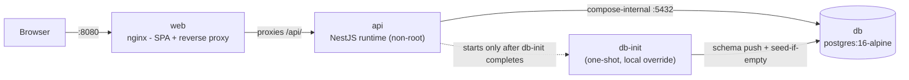

# Deployment and Operations

How to run Vaultchain's two supported topologies — npm-native local development and the all-in-Docker demo — plus the configuration reference, production boot behavior, and the operational surface (health, logs, correlation, scale-out). Written for operators and engineers standing the stack up outside their editor.

## Two topologies

| | npm-native development | Docker demo |
| --- | --- | --- |
| Start | `npm run dev` (after one-time `npm run setup`) | `npm run demo` |
| Web | Angular dev server on `:4200` | nginx serving the built SPA on `:8080` |
| Api | NestJS on `:3000` (prefix `/api/v1`) | Container, published on `127.0.0.1:3000` by default |
| Database | Compose `db` service published on `127.0.0.1:55432` | Same `db` service, compose-internal |
| CORS | Exercised (cross-origin `:4200` to `:3000`) | Not exercised — the SPA talks to nginx same-origin, nginx proxies `/api/` |
| Best for | Day-to-day development with hot reload | One-command evaluation on a trusted local machine or private network |

Both paths share the same PostgreSQL container and the same seed, so switching between them keeps your data. Zero-to-running steps for the npm-native path live in [getting started](getting-started.md); the Docker path is summarized here and detailed in [DOCKER.md](../DOCKER.md).

## Docker demo topology

`npm run demo` runs `docker compose up --build` from [`docker-compose.yml`](../docker-compose.yml), with [`docker-compose.override.yml`](../docker-compose.override.yml) auto-merged for the local demo experience:

> [!WARNING]
> This compose topology is not a production deployment. Docker publishes the web port on all host
> interfaces by default, while the seeded Administrator account uses publicly documented demo
> credentials. Run it only on a trusted local machine or private network; do not expose port `8080`
> to an untrusted network.



| Service | Image / build | Notes |
| --- | --- | --- |
| `db` | `postgres:16-alpine`, digest-pinned | Internal-only in the base file; the local override publishes it on `127.0.0.1:55432` so the npm-native path can share it. Healthcheck via `pg_isready`; data persists in the `pgdata` volume. |
| `api` | [`Api/Dockerfile`](../Api/Dockerfile), two-stage `node:22-bookworm-slim`, digest-pinned | Runtime stage carries production dependencies only, runs as the non-root `node` user, and self-reports health via a container `HEALTHCHECK` on `GET /api/v1/health`. Published on loopback (`127.0.0.1:3000`) by default so dev-fallback secrets are never reachable off-host; set `API_BIND=0.0.0.0` explicitly (with real secrets) to expose it. |
| `web` | [`Web/Dockerfile`](../Web/Dockerfile), Node builder then `nginx:1.27-alpine`, digest-pinned | Serves the SPA on `:8080` and reverse-proxies `/api/` to `API_UPSTREAM` (default `http://api:3000`), templated at startup via `envsubst`. No backend URL is baked into the JS bundle — the production/stage builds use a relative `/api/v1` base. |
| `db-init` | Api builder stage (override only) | One-shot job: apply the committed migrations, then the additive integrity SQL, then seed-if-empty. The `api` service waits on `service_completed_successfully`, so there is no empty-database window. |
| `db-setup` | Api builder stage (base file, profile `setup`) | The explicit, opt-in schema-push-plus-seed for the base stack: `docker compose --profile setup run --rm db-setup`. Never runs on a plain `up`. |

`NG_CONFIGURATION` defaults to `stage` for the web image: an optimized build with the same relative `/api/v1` API base, but without the production per-component SCSS budget gate — budgets are enforced where they belong, in the CI `web` job's production build. Build with `NG_CONFIGURATION=production` to apply the budget gate at image build time as well.

The base compose file keeps the database internal and seeding as a separate opt-in step for
CI-oriented container validation: `docker compose -f docker-compose.yml up --build` skips the
override entirely. It still runs the API with `NODE_ENV=development` and dev fallback configuration,
so it is not a production topology.

## Seed-once mechanics

The demo seeds itself exactly once, and only when the database is genuinely empty:

- `db-init` applies the committed migrations (baselining a volume that predates them rather than dropping it), applies `Api/prisma/sql/integrity.sql` (constraints the Prisma schema cannot express), then checks the sentinel `SELECT count(*) FROM public.metric_daily`. Rows present means an initialized database — the seed is skipped and data is preserved across `up`/`down`.
- An empty sentinel triggers the dev seed: 1,500 fictional customers with realistic transaction patterns, three demo users (one per role — Administrator, Compliance Officer, Viewer), and TRY, USD and EUR currencies. Demo sign-in details are listed in [getting started](getting-started.md).
- Force a clean reseed at any time (this also permits the destructive schema sync):

```bash
FTD_SEED_FORCE=1 docker compose run --rm db-init
```

`FTD_DB_ACCEPT_DATA_LOSS=1` permits a destructive `prisma migrate reset` without forcing a reseed.

## Configuration reference

Names and purposes only — never put real values in documentation, commits, or logs. Compose variables live in a local `.env` (gitignored) copied from [`.env.docker.example`](../.env.docker.example); the stack also starts with zero configuration using built-in dev defaults.

### Compose variables

| Variable | Purpose |
| --- | --- |
| `POSTGRES_USER` / `POSTGRES_PASSWORD` / `POSTGRES_DB` | Credentials and database name for the `db` service |
| `API_HOST_PORT` | Host port for the API (default 3000) |
| `WEB_HOST_PORT` | Host port for the web UI (default 8080) |
| `JWT_ACCESS_SECRET` / `JWT_REFRESH_SECRET` | Token signing keys passed through to the API |
| `CORS_ORIGINS` | Browser origin allowlist passed through to the API |

The compose files additionally recognize `API_BIND` (bind address for the API port, loopback by default), `DB_HOST_PORT` (override's host port for PostgreSQL), `NG_CONFIGURATION` (web build configuration), and the seed switches `FTD_SEED_FORCE` / `FTD_DB_ACCEPT_DATA_LOSS`.

### Api runtime variables

Core variables are validated fail-fast at boot by [`Api/src/config/env.validation.ts`](../Api/src/config/env.validation.ts) — the process refuses to start on missing or invalid configuration, and error messages name the variable, never its value. `TRUST_PROXY` and `DB_RLS_ENFORCED` are the two exceptions: each is read directly from the environment at its point of use, with a safe-off default.

| Variable | Purpose |
| --- | --- |
| `NODE_ENV` | `development` / `test` / `production`; production arms the fail-fast hardening rules below |
| `PORT` | API listen port (default 3000) |
| `DATABASE_URL` | PostgreSQL connection string used by the application at runtime |
| `MIGRATE_DATABASE_URL` | Optional owner/migrator connection for DDL, for deployments where the app runs as a least-privilege database role |
| `JWT_ACCESS_SECRET` / `JWT_REFRESH_SECRET` | Token signing keys (minimum 16 characters everywhere; stricter in production) |
| `FTD_PII_MASTER_KEY` | Master key for PII envelope encryption (base64, 32 bytes); required in production, dev falls back to a clearly labeled dev-only key |
| `CORS_ORIGINS` | Comma-separated browser origin allowlist; required in production |
| `REDIS_URL` | Optional scale-out seam — see below; unset means single-instance in-memory behavior |
| `DB_RLS_ENFORCED` | Default off; `1`/`true` activates the row-level-security session context on the wired write paths |
| `TRUST_PROXY` | Off by default; hop count or trusted-proxy list so per-IP throttling sees the real client behind a load balancer |

## Production boot behavior

With `NODE_ENV=production` the API fails fast rather than degrading:

- **Secrets:** JWT signing secrets must be at least 32 characters and must not match the documented `change-me` sample values; `FTD_PII_MASTER_KEY` is mandatory.
- **CORS:** an explicit `CORS_ORIGINS` allowlist is required — the localhost dev fallback is refused.
- **Rate limiting is non-negotiable:** the `THROTTLE_DISABLED` test kill-switch aborts a production boot. The throttler runs globally at 100 requests/min/IP, with tighter tiers on auth endpoints (10/min) and customer writes (30/min).
- **Redis hygiene:** a set `REDIS_URL` must use TLS (`rediss://`) or carry an AUTH component — plaintext, unauthenticated Redis is refused.
- **Headers:** HSTS (max-age 15552000, includeSubDomains) is emitted in production only; the locked-down CSP (`default-src 'none'`, `frame-ancestors 'none'`) applies in every environment.

## Operating the API

- **Health.** `GET /api/v1/health` is public and database-free — it reflects process liveness only and returns `status` plus `uptimeSeconds` inside the standard `{ data, meta }` envelope. The same route backs the Docker `HEALTHCHECK`.

```bash
curl -s http://localhost:3000/api/v1/health
```

- **Logs.** Structured JSON via pino (`nestjs-pino`), with `authorization`, `cookie` and `set-cookie` headers redacted at the logger level.
- **Correlation.** Every response carries `meta.correlationId`; an inbound `X-Correlation-Id` header is honored (it is on the CORS allowlist so the SPA can send one), otherwise the API generates a UUID. Error responses carry the same identifier in `error.correlationId`, so a user-reported error maps directly to log lines.

## Scaling out: the Redis seam

The API is single-instance by default and horizontally scalable by configuration:

- **`REDIS_URL` unset** — in-memory rate-limit counters and a single-process Server-Sent Events (SSE) stream. Correct for one instance; the default everywhere.
- **`REDIS_URL` set** — a shared ioredis client provides distributed rate-limit counters and cross-instance realtime fan-out over the pub/sub channel `ftd:realtime:dashboard`, so SSE clients on any instance see the same events behind a load balancer. Redis failures degrade gracefully and never crash the app.

## Honest boundary

This repository deliberately stops at the container boundary:

- **No deploy pipeline, no cloud target, no IaC.** CI builds and validates both images but never pushes or publishes; there is no environment promotion, no release automation. The digest-pinned images plus the compose stack are the delivery artifact.
- **No metrics, tracing, or alerting stack.** The in-repo observability surface is the health route, structured logs, and correlation IDs. Anything beyond that belongs to a deployment platform.
- **RLS ships wired but off.** Database row-level security policies and the per-request session context exist, gated behind `DB_RLS_ENFORCED` — flipping it on is a deploy-target action, tracked on the [roadmap](roadmap.md).

## Command reference

```bash
# Docker demo
npm run demo          # docker compose up --build  (web :8080, api 127.0.0.1:3000, seed-once)
npm run demo:down     # docker compose down        (data persists in the pgdata volume)
FTD_SEED_FORCE=1 docker compose run --rm db-init    # force a clean reseed

# Base stack without the local override (CI-oriented validation; not production deployment)
docker compose -f docker-compose.yml up --build
docker compose --profile setup run --rm db-setup    # explicit, opt-in schema push + seed
```

```bash
# npm-native local development
npm run setup         # one-time, idempotent: install both workspaces + create/seed the dev DB if empty
npm run dev           # web :4200 + api :3000 + compose db on 127.0.0.1:55432
npm run dev:api       # backend only
npm run dev:web       # frontend only
npm run db:reset      # reset and reseed the local development database
```

## See also

- [Documentation hub](README.md)
- [Getting started](getting-started.md)
- [Docker guide](../DOCKER.md)
- [Security model](security-model.md)
