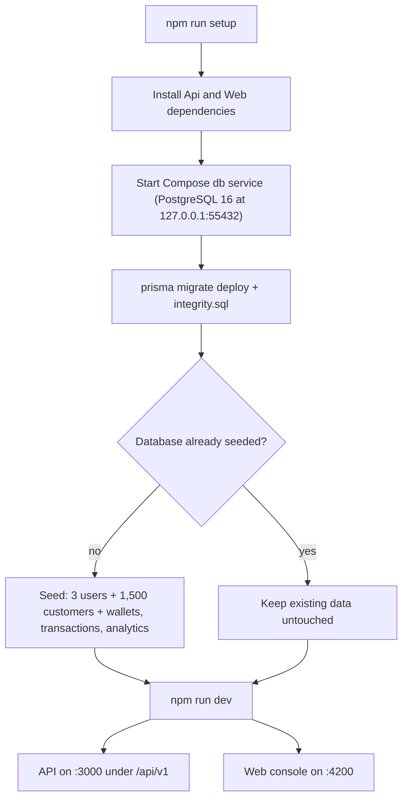

# Getting Started

This guide takes you from a fresh clone to a fully seeded, running Vaultchain stack — Angular web console, NestJS API, and PostgreSQL — with two commands. It is written for engineers evaluating or developing the project locally.

## Prerequisites

| Requirement | Version | Why |
| --- | --- | --- |
| Node.js | 22 (pinned in [`.nvmrc`](../.nvmrc); root `engines` requires `>=22`) | Runs the web dev server, the API, and all tooling |
| Docker Desktop | Any recent release | The dev database is a PostgreSQL 16 container managed for you by the dev scripts |
| npm | Ships with Node 22 | No global CLI installs are needed — everything runs through `npm` scripts |

If you use `nvm`, `nvm use` in the repo root picks up the pinned Node version automatically.

## The 60-second path

```bash
npm run setup   # once per clone
npm run dev     # every day
```

That is the whole flow. In detail:

- **`npm run setup`** ([`scripts/setup.mjs`](../scripts/setup.mjs)) installs dependencies for both workspaces (`Api/`, then `Web/`) and prepares the database: it starts the Docker Compose `db` service, applies the Prisma schema, runs the integrity SQL, and seeds demo data — **only if the database is empty**.
- **`npm run dev`** ([`scripts/dev.mjs`](../scripts/dev.mjs)) starts the same Compose `db` service (PostgreSQL 16, published to the host at `127.0.0.1:55432`), waits for it to become healthy, re-applies the schema idempotently (`prisma migrate deploy` plus [`integrity.sql`](../Api/prisma/sql/integrity.sql)), then runs the API in watch mode on `:3000` and the web app on `:4200` in one terminal. Stopping with `Ctrl-C` shuts both down cleanly.

Seeding is guarded by a sentinel check (the seed backfills the `metric_daily` analytics rollup last, so its row count proves a complete seed). An already-populated database is never touched — your data survives restarts. No `.env` file and no secrets are required for local development.



## Demo sign-in

The seed creates three users, one per role. The shared password is `Test-Passw0rd!` — public by design; every record in the database is fictional demo data.

| Email | Role | What it can do |
| --- | --- | --- |
| `admin@example.com` | Administrator | Everything: customer soft-delete, PII reveal, role and user management, MFA (TOTP two-step verification) reset, password-reset approvals |
| `operator@example.com` | Compliance Officer | Day-to-day customer operations — no delete, no PII reveal, no role management |
| `auditor@example.com` | Viewer | Read-only across the console |

Signing in with each account is the fastest way to see the permission system at work: buttons and routes disappear or are guarded depending on the role.

## What runs where

| Surface | URL |
| --- | --- |
| Web console | `http://localhost:4200` |
| API base | `http://localhost:3000/api/v1` |
| API health check | `http://localhost:3000/api/v1/health` |
| OpenAPI document | `http://localhost:3000/api/v1/docs-json` |
| Dev database | `127.0.0.1:55432` (Compose `db` service, loopback only) |

### Docker alternative

Prefer containers for everything? `npm run demo` (`docker compose up --build`) builds and runs the full stack — the web console is served by nginx at `http://localhost:8080`, and the auto-merged Compose override publishes the database loopback-only at `127.0.0.1:55432`, the same `db` service and port the local dev flow uses. See [DOCKER.md](../DOCKER.md) for services, configuration, and the seed-once behavior of the `db-init` job.

## Your first ten minutes

A guided tour that touches every major surface:

1. **Sign in** at `http://localhost:4200` as `admin@example.com`. The login screen lists the demo roles, so you can switch identities later without hunting for credentials.
2. **Watch the dashboard.** The KPI cards and the recent-customers list are live: they update over a Server-Sent Events stream, not polling. Create a customer in a second tab and watch the first tab react.
3. **Open Customers.** Search, filters, and pagination are server-driven; the search box matches name, email, and wallet number.
4. **Open a customer 360°.** One screen combines profile, KYC history, wallet balance, transaction history, and risk assessments.
5. **Reveal PII as the Administrator.** National IDs are stored encrypted and displayed masked (last 4 digits). The reveal toggle is admin-only, requires an explicit `?reveal=true` server round-trip, and writes an audit record — try the same screen as `operator@example.com` and the control is gone.
6. **Visit Settings.** Switch between light and dark themes and between English and Turkish — the whole console, including validation messages and error toasts, is translated.


## Troubleshooting

| Symptom | Cause | Fix |
| --- | --- | --- |
| A port is already in use | Another process owns `4200`, `3000`, or `55432` | Stop the other process, or override with env vars: `PORT` for the API, `DB_HOST_PORT` for the database port mapping |
| `npm run dev` fails immediately with a Docker error | Docker Desktop is not running | Start Docker Desktop and re-run |
| `prisma migrate deploy` fails on a drifted local schema | Your local database no longer matches the committed migrations | `npm run db:reset` — intentionally destroys and reseeds the dev database |
| Data looks stale or broken and you want a clean slate | Seed runs only when the database is empty | `npm run db:reset` for the local stack; `FTD_SEED_FORCE=1 docker compose run --rm db-init` for the Docker stack |
| Node version errors during install or build | Node older than 22 | `nvm use` (reads [`.nvmrc`](../.nvmrc)), then re-run `npm run setup` |
| API is up but data requests fail | Database container stopped (for example after a reboot) | Re-run `npm run dev` — it restarts and health-checks the `db` service before launching the API |

## Command reference

The everyday root commands, verbatim from [`package.json`](../package.json) — the full script list (E2E lanes, per-stack builds, stricter check variants) lives there:

| Command | What it does |
| --- | --- |
| `npm run setup` | One-time install (Api + Web) plus create-and-seed of the dev database (only if empty) |
| `npm run dev` | Database + API (`:3000`) + Web (`:4200`) together, one terminal |
| `npm run dev:api` | Database + API only |
| `npm run dev:web` | Web only (expects an API already reachable on `:3000`) |
| `npm run db:reset` | Force a clean reseed — destroys dev data on purpose |
| `npm run demo` | Full stack in Docker (`docker compose up --build`), web at `:8080` |
| `npm run demo:down` | Stop the Docker stack |
| `npm run web:test` | Web unit and component tests (Vitest, with coverage) |
| `npm run api:test` | API unit tests (Jest) |
| `npm run e2e` | Cypress end-to-end suite (Chrome) |
| `npm run verify` | The full local quality gate |
| `npm run verify:fast` | The quick variant of the quality gate |
| `npm run coverage:check` | Both stacks with coverage plus the per-file ≥90% gate |
| `npm run docs:check` | Documentation link integrity |
| `npm run i18n:check` | English/Turkish translation parity |
| `npm run deps:check` | Dependency license allowlist |
| `npm run sensitive:check` | Secret and sensitive-file tracking scan |

## See also

- [Documentation hub](README.md)
- [Architecture](architecture.md)
- [Testing and quality](testing-and-quality.md)
- [Docker guide](../DOCKER.md)
