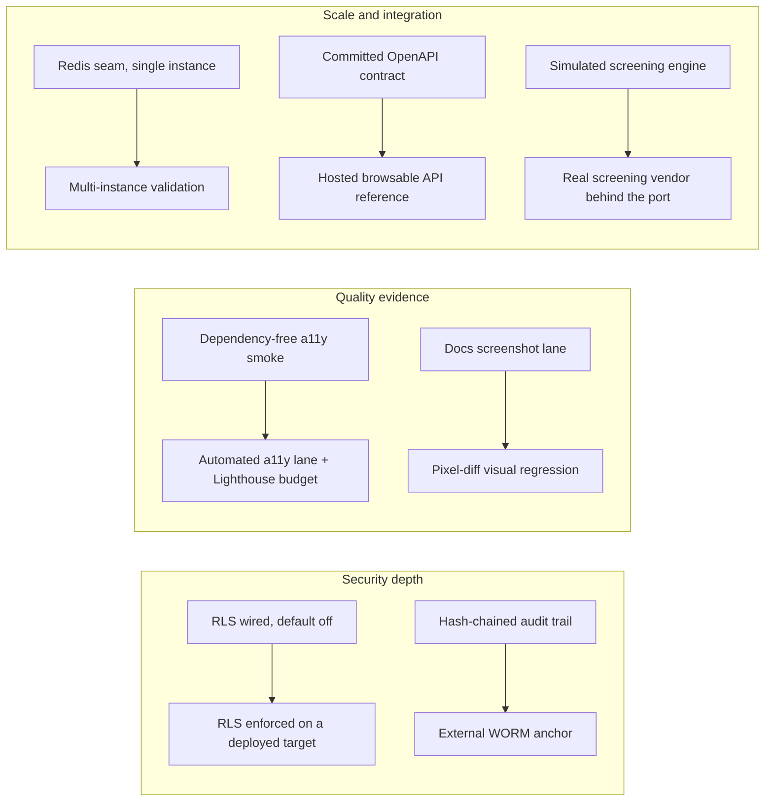

# Roadmap

Where the engineering effort goes next, and why. This is an honest roadmap in the same spirit as the rest of the documentation: no dates, no version pledges — each item names the problem it solves and the groundwork that already exists in this tree, so the distance from "wired" to "done" is visible.

## Direction at a glance

Every item below is an extension of something already built, not a green-field wish. The pattern is deliberate: land the seam first (schema columns, a DI port, a config switch, a capture lane), prove it with tests, then finish the last mile when the missing prerequisite — usually a deploy target or a new dependency — is available.

## Near term

| Item | Why it matters | Groundwork already in the repo |
| --- | --- | --- |
| Enforce database row-level security on a deployed target | Defense at the SQL layer: even if application-level authorization ever regresses, the database itself refuses out-of-policy rows. | Policies and least-privilege roles in [`Api/prisma/sql/db-security.sql`](../Api/prisma/sql/db-security.sql); a per-request session context ([`Api/src/infrastructure/prisma/rls-context.ts`](../Api/src/infrastructure/prisma/rls-context.ts)) wired into customer writes; the `DB_RLS_ENFORCED` switch (default off); the `MIGRATE_DATABASE_URL` seam for the owner/migrator role split; a dedicated real-PostgreSQL integration suite (`db-rls-enforcement.int-spec.ts`). What remains is a deployment whose connection runs as the least-privilege role with the switch on. |
| External WORM anchor for the audit chain | The hash chain makes tampering detectable, but a privileged database actor could rewrite the entire chain; anchoring the chain head in an external write-once store makes that rewrite evident. | Append-only `audit_logs` with a `prev_hash`/`entry_hash` SHA-256 chain, appends serialized on a PostgreSQL advisory lock, and append-only `REVOKE`s at the role level. The anchor export is designed but not built. |
| Accessibility and performance evidence | UI quality claims should be as measured as the coverage claims — an automated a11y lane and a Lighthouse budget turn "looks right" into numbers. | A dependency-free a11y/layout/performance smoke already runs in Cypress ([`Web/cypress/support/quality.ts`](../Web/cypress/support/quality.ts), the `e2e:quality` lane), and production bundle budgets (650 kB warn / 1 MB error) are enforced in CI. |
| Visual regression for the screenshot lane | Documentation screenshots and UI drift are compared by eye today; pixel diffs make drift a reviewable CI signal instead of a judgment call. | A deterministic capture lane exists (`npm --prefix Web run e2e:docs-shots` against the seeded stack) with artifacts under `Web/cypress/artifacts/`. An open-source pixel-diff Cypress plugin (`cypress-image-diff-js`) was evaluated and selected — it keeps baselines in-repo with no external screenshot service; adding it is gated on dependency approval. |

## Later

| Item | Why it matters | Groundwork already in the repo |
| --- | --- | --- |
| Hosted browsable API reference | Reviewers should be able to explore the contract without cloning the repo or booting the API. | The contract is code-first and committed ([`Api/openapi.json`](../Api/openapi.json), 54 paths / 61 operations) with generated TypeScript types, served at `/api/v1/docs-json`, and protected by a CI drift gate — rendering it is purely a publishing step. The interactive Swagger UI is deliberately disabled today because it would require one extra dependency. |
| Redis-backed multi-instance validation | The horizontal-scale seam should be proven under a real load balancer, not just unit-tested: shared throttle counters and cross-instance SSE fan-out behaving as one system. | The `REDIS_URL` seam is fully wired — distributed rate-limit counters plus realtime pub/sub on `ftd:realtime:dashboard` — with graceful degradation and a production fail-fast that refuses plaintext, unauthenticated Redis. |
| Real screening vendor behind the port | The Web3 risk signals are simulated and labeled as such; a real AML/screening vendor turns the feature from demonstration into production capability. | A pluggable provider port with an `isSimulated` honesty flag ([`Api/src/modules/risk/screening/screening-provider.ts`](../Api/src/modules/risk/screening/screening-provider.ts)); the rule-based engine is the default DI binding, and results already persist through the `RiskAssessment`/`RiskSignal` models — a vendor adapter implements the same interface with no schema churn. |

## Deliberately out of scope

Some absences are decisions, not gaps — they hold regardless of roadmap progress:

- **Public deployment and release automation.** This is a portfolio system; CI validates images but nothing ships. See the [deployment boundary](deployment-and-operations.md).
- **Custodial Web3 operations.** The on-chain surface stays read-only and key-free against public JSON-RPC — screening a wallet never means controlling one.
- **Real personal data.** The seed is fictional by construction and stays that way; PII handling is exercised end to end on synthetic records only.

## See also

- [Documentation hub](README.md)
- [Security model](security-model.md)
- [Testing and quality](testing-and-quality.md)
- [Deployment and operations](deployment-and-operations.md)
