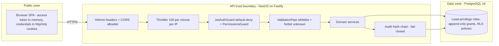

# Security Model

Vaultchain's defense-in-depth posture: the controls at each layer, how PII and the audit trail are protected, what the database enforces on its own, and — just as deliberately — what is designed but not yet live. Written for security reviewers and engineers extending the system.

## Layers

| Layer | Control |
| --- | --- |
| Transport and headers | Helmet with an explicit lockdown CSP — `default-src 'none'`, `frame-ancestors 'none'`, `base-uri 'none'` (a JSON-only API renders nothing); HSTS in production (`max-age` 15552000, `includeSubDomains`) |
| Cross-origin | Explicit CORS allowlist from `CORS_ORIGINS`, `credentials: true` only because the origin list is specific (never `*`); allowed headers include `Idempotency-Key` and `X-Correlation-Id` |
| Input validation | Global `ValidationPipe` with `whitelist` + `forbidNonWhitelisted` (mass-assignment defense) + `transform`; UUID pipes on path params; Prisma parameterizes every query |
| Authentication | Argon2id password hashing, 15-minute in-memory access JWT, rotating refresh cookie with replay detection, account lockout (5 failures, 15 minutes), opt-in MFA (TOTP two-step verification) |
| Authorization | Default-deny global auth guard plus permission-code guard on every route; three seeded roles |
| Rate limiting | 100/min per IP globally, 10/min on auth endpoints, 30/min on money writes, 5/min and 3/min on the password-reset entry points |
| PII at rest | AES-256-GCM envelope encryption for the national ID, mask-by-default responses, audited reveal |
| Audit | Append-only, SHA-256 hash-chained `audit_logs`, serialized appends, fail-closed with the business transaction, hashed IPs |
| Database privileges | Least-privilege SQL roles, append-only `REVOKE`, row-level security policies (runtime flag, default off) |
| Supply chain | License allowlist, tracked-secret scan, Trivy HIGH/CRITICAL enforcement, SHA-pinned actions, digest-pinned base images |

## Trust boundaries

The browser is untrusted: it holds the access token only in memory, and every credential that must persist rides in an httpOnly cookie the page cannot read. The API is the sole authority for authentication, authorization, validation, money movement, and audit. The database adds its own privilege floor beneath the application.

## Secrets and fail-fast configuration

The API refuses to boot in production with weak or missing security configuration — misconfiguration is a loud failure, not a silent downgrade:

| Boot guard | Rule in production |
| --- | --- |
| JWT secrets | `JWT_ACCESS_SECRET` and `JWT_REFRESH_SECRET` must be at least 32 characters |
| CORS | `CORS_ORIGINS` must be an explicit allowlist; the localhost dev fallback is refused (and even in dev it warns loudly) |
| Rate limiting | `THROTTLE_DISABLED` (the test-only kill switch) must not be set — the throttler cannot be turned off in production |
| Redis | A configured `REDIS_URL` must not be plaintext/unauthenticated |
| Database role | A boot-time probe reads `is_superuser` and refuses to start if the runtime connection is a superuser — a superuser silently bypasses row-level security |

Guards log only the variable name and the violated rule, never the value. `FTD_PII_MASTER_KEY` (base64, 32 bytes) supplies the PII master key; local development runs on safe defaults with no secrets in the repository. The full variable reference lives in [deployment and operations](deployment-and-operations.md).

## Rate limiting

Limits are per IP per minute, enforced by `@nestjs/throttler` classes:

| Class | Limit | Applies to |
| --- | --- | --- |
| Global default | 100/min | every route without a stricter class |
| Auth | 10/min | login, refresh, MFA verification, reset status polls, admin resets |
| Financial and customer writes | 30/min | transaction posting, customer create/update/delete, wallet limits |
| Reset initiate | 5/min | self-service password-reset start |
| Reset request | 3/min | administrator-approval reset queue entry |

With `REDIS_URL` set, counters move to Redis so the limit holds across instances; a Redis outage fails closed for throttled requests until the shared counter store recovers. There is deliberately no per-instance fallback because it would multiply and reset the global abuse budget. Deployments that do not need shared counters can leave `REDIS_URL` unset and use the built-in local store. `TRUST_PROXY` controls whether the client IP is derived from a trusted `X-Forwarded-For`, so per-IP throttling and audit IP hashes survive a reverse proxy.

## PII handling

- **Mask by default.** Customer name, email, phone, wallet number, and address are masked in every response. Unmasking requires the `customers.pii.reveal` permission **and** an explicit `?reveal=true`, and each effective reveal is audited — the full flow is in [Authentication and RBAC](auth-and-rbac.md).
- **The national ID is never decrypted on read.** It is stored as `national_id_enc` — AES-256-GCM envelope encryption with a random per-value data key, wrapped by a master key. Every read path shows the stored last-4 column only; no endpoint returns the full value.
- **Envelope design.** The ciphertext is bound to its row through GCM additional authenticated data, so a stolen blob cannot be replanted onto another record. A per-row `keyId` lets master-key rotation re-wrap data keys without re-encrypting plaintext. A keyed blind index (HMAC-SHA256) makes plaintext uniqueness enforceable by a `UNIQUE` constraint over randomized ciphertext.
- **KMS-agnostic port.** The encryptor is an interface; the local master-key implementation is the dependency-free default, and a cloud KMS binding is a deploy-time swap, not a redesign.
- **Logs stay clean.** Credential-bearing request bodies are never logged; audit context carries masked values; IPs are stored as SHA-256 hashes.

## Audit trail

Sensitive actions append to `audit_logs`, a table designed to be tamper-evident twice over:

- **Hash chain.** Each row stores `entry_hash = SHA-256(prev_hash | canonical(payload))`, with a fixed, documented, non-secret genesis seed for row 0. Canonical serialization (sorted keys, ISO timestamps) makes the chain reproducible for verification; editing or deleting a historical row breaks it detectably. Appends serialize on a Postgres advisory lock so the chain stays linear under concurrency.
- **Append-only at the privilege level.** [`db-security.sql`](../Api/prisma/sql/db-security.sql) revokes `UPDATE` and `DELETE` on `audit_logs` (and `ledger_entries`) from the runtime role — immutability is a grant, not a convention.
- **Fail-closed.** The audit write joins the caller's database transaction: if the audit row cannot be written, the business change rolls back with it. Denied attempts are recorded as standalone `DENIED` rows.
- **Privacy inside the trail.** Rows carry `ipHash` rather than raw IPs and masked context rather than raw PII, plus the request correlation id.

## Database security

Beneath application authorization, [`db-security.sql`](../Api/prisma/sql/db-security.sql) provisions a least-privilege role matrix:

| Role | Purpose |
| --- | --- |
| `migrator` | Owns DDL and backfills; never the app's runtime role |
| `app_rw` | Runtime privilege group — read/write on mutable tables, **no** `UPDATE`/`DELETE` on append-only tables |
| `audit_writer` | INSERT-only audit sink |
| `readonly_analytics` | SELECT on the analytics rollup only |
| `app_login` | The LOGIN role the app connects as — a member of `app_rw`, owns nothing, so RLS applies to it |

Row-level security policies exist on `customers`, `risk_assessments`, and `audit_logs`. The runtime wiring is implemented end to end — a request-scoped operator context (`AsyncLocalStorage`), and a transaction-local preamble that sets `ROLE app_rw` plus an `app.user_id` GUC on customer writes — but it is **flag-gated and off by default** (`DB_RLS_ENFORCED` unset means no-op). Under the local/CI superuser connection PostgreSQL bypasses RLS anyway; the production boot probe above exists precisely to make that bypass impossible to ship silently. A dedicated integration spec provisions the roles on a real PostgreSQL, connects as `app_login`, and proves the grant matrix, the append-only denials, policy filtering, and that the GUC is transaction-local (no cross-request leakage on pooled connections).

Enabling enforcement in a real deployment is a two-step flip: point `DATABASE_URL` at `app_login` (with `MIGRATE_DATABASE_URL` retained for owner-level DDL) and set `DB_RLS_ENFORCED=1`. Rollback is the reverse — the pre-flip state is fully functional.

## Supply chain

- **License allowlist** — `npm run deps:check` fails the build on any dependency outside the approved license set.
- **Tracked-secret scan** — `npm run sensitive:check` fails if secret-shaped files or values are tracked by git.
- **Vulnerability gate** — Trivy scans the repository in CI with `severity: HIGH,CRITICAL`, `ignore-unfixed: true`, and `exit-code: '1'`: a fixable HIGH/CRITICAL finding blocks the merge gate. The only escape valve is [`.trivyignore`](../.trivyignore) — one CVE per line with a written justification and review date.
- **Pinned execution** — every GitHub Action is pinned to a commit SHA; Docker base images are digest-pinned; the API runtime image installs with `npm ci --omit=dev --ignore-scripts` and runs as a non-root user.
- **No deploy pipeline by design** — CI builds, tests, and scans but never publishes; there is no credential in CI that could push anywhere.

## Honest gaps

Stated plainly, because a security document that hides its edges is worthless:

- **RLS is wired but not enforcing.** `DB_RLS_ENFORCED` defaults to off, and no deployment currently runs under `app_login`. The design, code, and integration proof exist; the live flip needs a deploy target with secret-managed credentials.
- **The WORM audit anchor is designed, not built.** Anchoring the daily last `entry_hash` to external write-once storage would make the chain tamper-evident even against a database administrator; today the chain's integrity guarantee is in-database only.
- **Cloud KMS is a deploy-time binding.** PII encryption currently wraps data keys with a local master key from `FTD_PII_MASTER_KEY`; the KMS-backed implementation is an interface swap that has not been exercised against a real provider.
- **Risk signals are simulated.** AML/Web3 screening signals are generated and labeled as simulated — this is a portfolio system with no real compliance data feed.

Progress on these items is tracked in the [roadmap](roadmap.md).

## Reporting

Found something? Please follow the disclosure process in [SECURITY.md](../SECURITY.md) — it covers scope, what to include, and how secrets and PII in reports are handled.

## See also

- [Documentation hub](README.md)
- [Authentication and RBAC](auth-and-rbac.md) — sessions, MFA, roles, PII reveal
- [Data model](data-model.md) — the schema-level integrity mechanisms
- [Deployment and operations](deployment-and-operations.md) — configuration reference and production hardening
