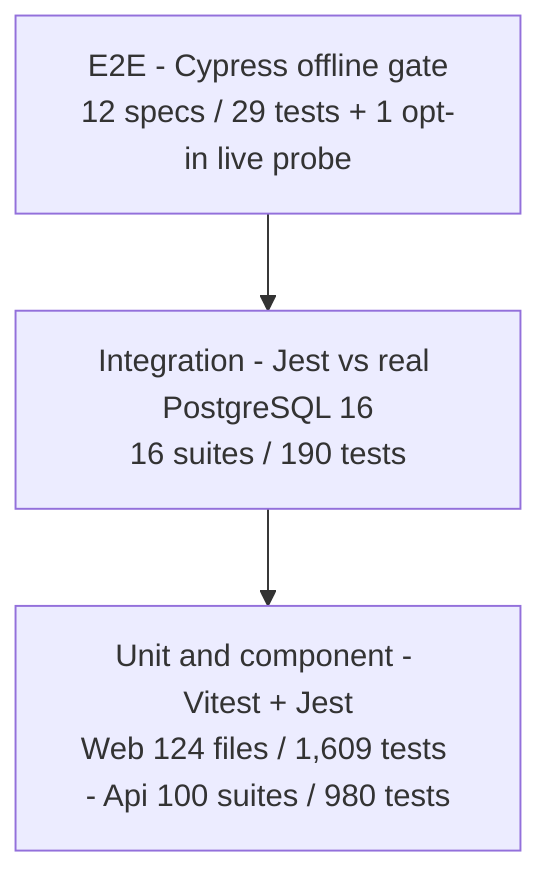

# Testing and Quality

How Vaultchain is tested, which quality gates are enforced (not aspirational), and how to run every lane locally. This page serves engineers evaluating the codebase and contributors who need to keep the gates green.

## Philosophy

The suite is a classic pyramid with one twist at each level: the base is large and deterministic, the middle runs against a **real database**, and the top runs against **contract-checked stubs** so it stays deterministic too. Anything that touches a live system is opt-in and clearly armed.

- **Fast and deterministic by default.** Unit and component tests (Vitest on the web, Jest on the API) run with no network, no database, no shared state.
- **Integration means a real PostgreSQL.** The API integration suites self-provision a `postgres:16-alpine` container, push the schema, and exercise the real HTTP stack — no in-memory database stand-ins.
- **E2E without a backend.** The Cypress gate stubs every API call with builders that are validated against the committed [`Api/openapi.json`](../Api/openapi.json) contract, so the browser tests are honest about the wire format yet never flake on a live service.
- **Live checks are explicit.** A read-only live-contract probe and a documentation screenshot lane exist, but both sit outside the default spec pattern and must be armed deliberately.



## Measured inventory

All numbers below were measured on this tree, all green.

| Layer | Runner | Volume | Coverage (measured) |
| --- | --- | --- | --- |
| Web unit/component | Vitest 4 (jsdom) | 124 spec files / 1,609 tests | 99.65% statements · 98.31% branches · 99.64% functions · 99.86% lines |
| Api unit | Jest 29 (ts-jest) | 100 suites / 980 tests | 99.6% statements · 97.45% branches · 99.41% functions · 99.85% lines |
| Api integration | Jest, real PostgreSQL (`postgres:16-alpine`) | 16 suites / 190 tests | exercises the real HTTP stack |
| E2E | Cypress 15 | 13 spec files: 12 offline (29 tests) + 1 opt-in live-contract probe | behavior gate, not coverage-measured |

## Enforced gates

Coverage numbers above are measured; the gates below are what CI actually fails on. The aggregate thresholds are ratchets locked in **below** the measured values (so they only ever tighten), and a uniform per-file floor prevents any single file from hiding behind the aggregate.

| Gate | Where it lives | Enforced level |
| --- | --- | --- |
| Web aggregate coverage | [`Web/vitest.config.ts`](../Web/vitest.config.ts) | statements 97 · branches 94 · functions 97 · lines 98 |
| Api aggregate coverage | [`Api/package.json`](../Api/package.json) `coverageThreshold` | statements 95 · branches 92 · functions 90 · lines 95 |
| Per-file coverage (both stacks) | [`scripts/check-file-coverage.mjs`](../scripts/check-file-coverage.mjs) via `npm run coverage:files:check` | every measured file ≥ 90% on all four metrics |
| Production bundle budgets | [`Web/angular.json`](../Web/angular.json), enforced by the production build in CI | initial bundle 650 kB warn / 1 MB error · per-component SCSS 8 kB warn / 18 kB error |

The per-file gate exists because Jest's `coverageThreshold` globs aggregate matched files as one number and Vitest's per-file mode would mean two different enforcement models. One dependency-free script reads both stacks' `coverage-summary.json` and fails if any file dips below the floor — a single audit trail for both codebases.

## Web unit and component lane

Vitest runs against jsdom with `@analogjs/vite-plugin-angular` compiling component templates and styles, so `TestBed.createComponent()` and signal `input()`/`output()` primitives are unit-testable without a browser. Coverage is collected on every run (`npm test` in `Web/` is `vitest --run --coverage`), so the thresholds are exercised locally exactly as in CI.

## Api unit and integration lanes

- **Unit** (`*.spec.ts`): plain Jest with ts-jest, DI-driven fakes via `@nestjs/testing`, no database.
- **Integration** (`*.int-spec.ts`, [`Api/jest-int.config.cjs`](../Api/jest-int.config.cjs), run with `--runInBand`): each suite self-provisions an ephemeral `postgres:16-alpine` container via `docker run`, applies the committed migrations with `prisma migrate deploy`, then drives the real Fastify HTTP stack with supertest — auth flows, hash-chain audit writes, idempotency replays and RLS behavior are proven against a genuine database. Requires a local Docker daemon.

## End-to-end architecture

Cypress is organized as a small set of layers so specs describe behavior while infrastructure concerns live in support code:

- `Web/cypress/e2e/*.cy.ts` — the **offline gate**. Every API interaction is stubbed with `cy.intercept`; stub builders are shape-checked against the committed OpenAPI contract, and a catch-all handler returns 404 for any unstubbed GET so a missing stub fails loudly instead of silently passing.
- `Web/cypress/live-contract/` — the opt-in live probe (deliberately outside the default spec pattern).
- `Web/cypress/support/screens/` — a screen-object DSL; selectors belong here, not in specs.
- [`Web/cypress/support/api-contracts.ts`](../Web/cypress/support/api-contracts.ts) — response-envelope and DTO-shape validators.
- [`Web/cypress/support/quality.ts`](../Web/cypress/support/quality.ts) — dependency-free accessibility, layout, performance and screenshot hooks.
- [`Web/cypress/support/test-policy.ts`](../Web/cypress/support/test-policy.ts) — quarantine helper for explicitly isolated flaky specs.

**Selector policy:** prefer `[data-testid]`; CSS classes are allowed only inside screen objects when no stable hook exists yet. **Flake policy:** one run-mode retry; a repeatedly failing spec is fixed or wrapped in `describeQuarantined(...)` (skipped by default, run only when `RUN_QUARANTINED=1` is exposed) with the failure reason in the spec header. **Artifacts:** everything lands under `Web/cypress/artifacts/` (screenshots, videos, downloads); CI uploads one artifact per browser leg so the matrix never clobbers itself.

### Lane map

| Lane | Command (repo root) | What it does | Prerequisite |
| --- | --- | --- | --- |
| Offline gate, Chrome | `npm run e2e` (= `web:e2e:chrome`) | All 12 offline specs against contract-checked stubs | Web dev server on `:4200` |
| Offline gate, Electron | `npm run web:e2e:electron` | Same suite on the second CI matrix browser | Web dev server on `:4200` |
| Cross-browser | `npm run web:e2e:cross-browser` | Runs both legs even if the first fails; per-leg PASS/FAIL summary, artifacts preserved across legs | Web dev server on `:4200` |
| Quality smoke | `npm run web:e2e:quality` | `quality-smoke.cy.ts` — dependency-free a11y/layout/performance assertions | Web dev server on `:4200` |
| UX audit | `npm run web:e2e:audit` | `browser-ux-smoke.cy.ts` with `CAPTURE_VISUAL_ARTIFACTS=1` — captures visual artifacts | Web dev server on `:4200` |
| Live contract | `npm run web:e2e:live-contract` | Read-only probe: GETs `/api/v1/health` on a live API and shape-checks the envelope; self-skips unless armed | A running API; **no** web server |
| Docs screenshots | `npm --prefix Web run e2e:docs-shots` | Captures the documentation screenshots (spec `Web/cypress/docs-screenshots/capture.cy.ts`, outside the default spec pattern) at the documented standard, against the same stubbed API the offline gate uses | Web dev server on `:4200` |

The docs-screenshots lane is the one lane that intentionally runs against the live seeded stack: it signs in as the demo administrator, forces English + light theme, and captures fixed-viewport frames into `Web/cypress/artifacts/` for manual review before any file is copied into `docs/assets/screenshots/` — see [screens.md](screens.md).

### Offline spec inventory

| Spec | Focus | Tests |
| --- | --- | --- |
| `api-contract.cy.ts` | Response envelope and DTO shapes vs the OpenAPI contract | 2 |
| `auth.cy.ts` | Sign-in, sign-out, error paths | 4 |
| `auth-session.cy.ts` | Session restore and expiry behavior | 2 |
| `browser-ux-smoke.cy.ts` | Cross-screen UX smoke (also the audit lane's spec) | 3 |
| `customers.cy.ts` | Customer list/detail/edit journeys | 3 |
| `mfa.cy.ts` | MFA (TOTP two-step verification) challenge flows | 5 |
| `notifications.cy.ts` | Notification center | 1 |
| `permissions.cy.ts` | Role-based UI gating | 2 |
| `quality-smoke.cy.ts` | Dependency-free a11y/layout/performance checks | 2 |
| `responsive-smoke.cy.ts` | Layout at mobile/desktop breakpoints | 2 |
| `settings.cy.ts` | Settings shell | 1 |
| `wallet-transactions.cy.ts` | Wallet and transaction views | 2 |

Total: 29 offline tests, plus the single self-skipping live-contract probe.

### Runtime switches

`allowCypressEnv` is disabled, so specs read switches via `--expose` on the CLI. Both `--expose` and `--config` are **single-value flags** — if either appears twice, only the last occurrence survives. Pass each exactly once and comma-separate multiple values.

| Exposed value | Effect |
| --- | --- |
| `RUN_QUARANTINED=1` | Runs specs wrapped in `describeQuarantined(...)` |
| `CAPTURE_VISUAL_ARTIFACTS=1` | Enables the explicit visual-capture hooks (embedded in the audit lane) |
| `RUN_LIVE_API_CONTRACT=1` | Arms the live-contract probe — without it the spec self-skips |
| `LIVE_API_BASE_URL=<url>` | Origin the live-contract probe targets |

## Repo-wide quality scripts

Zero-dependency Node scripts at the repo root guard cross-cutting concerns; the first four run in CI's `governance` job, and `verify` bundles them with the test/build pipelines for a pre-PR check.

| Script | Guards |
| --- | --- |
| `npm run docs:check` | Relative-link integrity across all tracked markdown |
| `npm run i18n:check` | Full TR/EN catalog parity (963/963 keys) and complete backend error-catalog translation (73/73 codes); `i18n:check:strict` adds a hardcoded-literal audit |
| `npm run sensitive:check` | Secret scan of tracked files — no credentials or generated artifacts in git |
| `npm run deps:check` | Dependency license allowlist |
| `npm run coverage:files:check` | The per-file ≥ 90% floor over both stacks' coverage summaries |
| `npm run coverage:check` | Api coverage + Web coverage + the per-file gate, in one command |
| `npm run verify` / `npm run verify:fast` | Aggregator: the four static checks plus Web lint/test/build and Api test/build (`--fast` skips the heavy test/build steps) |

## Continuous integration

One workflow, [`.github/workflows/ci.yml`](../.github/workflows/ci.yml), triggered on pull requests and pushes to `main`. All actions are SHA-pinned, permissions are read-only, and concurrent runs on the same ref cancel in progress. Deploy/publish is deliberately absent — CI validates, it does not ship.

| Job | Purpose | Timeout |
| --- | --- | --- |
| `web` | Prettier `format:check`, stylelint, Vitest with coverage thresholds, production build with bundle budgets | 20 min |
| `web-e2e` | Cypress offline gate on a Chrome + Electron matrix against a fresh `ng serve` | 20 min |
| `web-live-contract` | Optional live health probe; runs only when the `WEB_E2E_LIVE_CONTRACT_URL` repository variable is set | 10 min |
| `api` | `tsc --noEmit`, Jest unit suite, `nest build`, then the OpenAPI drift gate: `openapi:generate` + `git diff --exit-code` on the committed spec and generated types | 20 min |
| `api-integration` | `test:int` — integration suites against self-provisioned `postgres:16-alpine` | 30 min |
| `governance` | `deps:check`, `i18n:check`, `sensitive:check`, `docs:check` | 10 min |
| `docker` | Build validation for both images (Web built with `NG_CONFIGURATION=stage`) | 25 min |
| `security` | Trivy filesystem scan — HIGH/CRITICAL, `ignore-unfixed`, exit code 1 (enforced); triaged exceptions live in `.trivyignore` with justification | 15 min |
| `ci-gate` | Fans in every job above; configure branch protection to require this aggregate job | — |

```mermaid
flowchart LR
    subgraph parallel["Parallel jobs"]
        web["web"]
        webe2e["web-e2e<br>chrome + electron"]
        live["web-live-contract<br>(optional)"]
        api["api"]
        apiint["api-integration"]
        gov["governance"]
        docker["docker"]
        sec["security"]
    end
    web --> gate["ci-gate<br>(aggregate job)"]
    webe2e --> gate
    live -.->|"skipped until configured"| gate
    api --> gate
    apiint --> gate
    gov --> gate
    docker --> gate
    sec --> gate
```



`ci-gate` aggregates the required upstream jobs; the live-contract job may be `skipped` (until its repository variable is configured), but once it runs, any failure or cancellation blocks the aggregate job. Configure branch protection to require `ci-gate` before treating it as the merge gate.

## Running the gates locally

```bash
# Core local quality gate: static checks + Web lint/test/build + Api unit test/build.
# CI additionally runs OpenAPI drift, integration, E2E, Docker, and Trivy lanes.
npm run verify

# Coverage with every gate: Api floors + Web thresholds + the per-file >=90 check
npm run coverage:check
```

```bash
# Individual stacks
npm run web:test                  # Vitest + coverage (thresholds enforced)
npm run api:test                  # Jest unit
npm run api:test:cov              # Jest unit + coverage floors
npm --prefix Api run test:int     # integration — needs Docker (self-provisions postgres:16-alpine)
```

```bash
# E2E offline lanes — start the web dev server first (npm run dev:web)
npm run e2e                       # offline gate, Chrome
npm run web:e2e:electron          # offline gate, Electron
npm run web:e2e:quality           # a11y/layout/performance smoke
npm run web:e2e:audit             # UX smoke + visual artifacts
```

```bash
# Live-contract probe — no web server; point Cypress at a running API
npm run web:e2e:live-contract -- \
  --expose "RUN_LIVE_API_CONTRACT=1,LIVE_API_BASE_URL=http://localhost:3000" \
  --config "baseUrl=http://localhost:3000,specPattern=cypress/live-contract/live-api-contract.cy.ts"

# Documentation screenshots — web dev server on :4200, stubbed API (see docs/screens.md)
npm --prefix Web run e2e:docs-shots
```

## See also

- [Documentation hub](README.md)
- [Deployment and operations](deployment-and-operations.md)
- [Security model](security-model.md)
- [Roadmap](roadmap.md)
